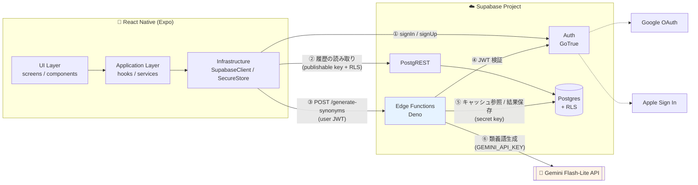
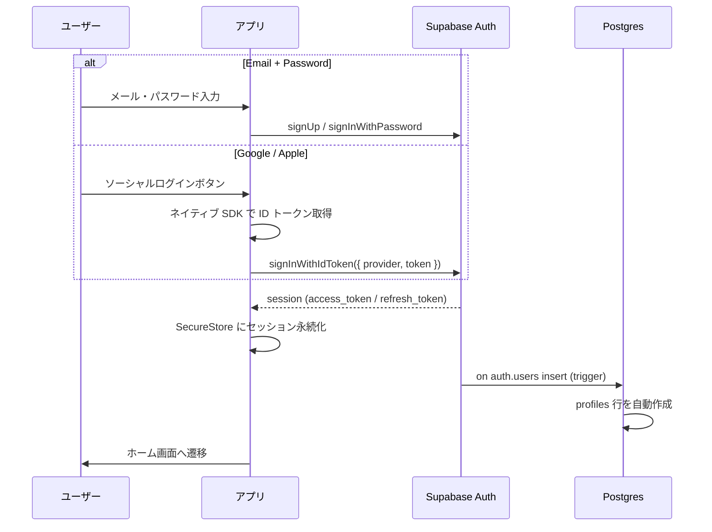
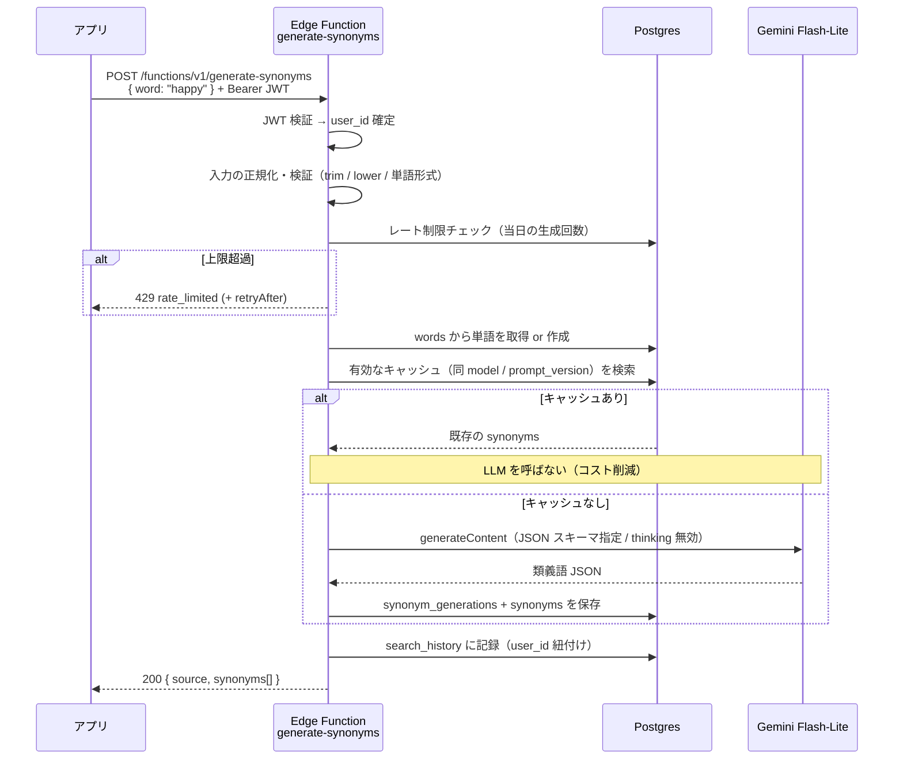

# アーキテクチャ

## 全体構成

OpenOwl は「モバイルクライアント + BaaS（Supabase）」の2層構成です。
専用のアプリケーションサーバは持たず、**特権が必要な処理だけを Edge Functions に置く**方針を取ります
（[ADR-0004](./adr/0004-edge-functions-for-privileged-ops.md)）。



### 各コンポーネントの責務

| コンポーネント | 責務 | 責務でないこと |
| --- | --- | --- |
| React Native アプリ | 画面表示、入力受付、セッション保持、自分のデータの読み取り | LLM の直接呼び出し、他ユーザーのデータ参照、特権キーの保持 |
| Supabase Auth | ユーザー登録・認証、JWT 発行、OAuth プロバイダ連携 | アプリ固有のプロフィール情報の保持（→ `profiles` テーブル） |
| Postgres + RLS | データの永続化と**アクセス制御の最終防衛線** | ビジネスロジックの中心（トリガーに業務ロジックを詰め込まない） |
| PostgREST | 自分のデータの読み取り API（RLS で保護） | 特権を要する書き込み |
| Edge Functions | LLM 呼び出し、生成結果の保存、レート制限、キャッシュ判定 | 単純な CRUD の代理（PostgREST で済むものは作らない） |
| Gemini Flash-Lite | 類義語の生成 | 認証・認可（呼び出し側の責務） |

## 信頼境界

```
┌─ 信頼できない ────────────────┐   ┌─ 信頼できる（サーバ側） ─────────┐
│ モバイルアプリ                 │   │ Edge Functions                   │
│  - publishable key            │   │  - secret key (service role)     │
│  - ユーザーの access token     │──▶│  - GEMINI_API_KEY                │
│  - 入力値（単語）              │   │  - JWT 検証済みの user_id        │
└──────────────────────────────┘   └─────────────────────────────────┘
```

- クライアントから届く値（`user_id` を含む）は**一切信用しない**。
  ユーザー識別は必ず検証済み JWT から取得する。
- `GEMINI_API_KEY` と secret key は Edge Functions の実行環境にのみ存在する。
- クライアントが持つ publishable key は公開前提。**保護は RLS が担う**。

詳細は [`security.md`](./security.md)。

## 主要フロー

### 1. 認証フロー



- セッションは端末のセキュアストレージ（iOS Keychain / Android Keystore）に保存する。
- `profiles` はトリガーで自動生成し、クライアントに作成責務を持たせない
  （クライアント任せだと作成漏れの行が発生し、RLS の前提が崩れるため）。
- Apple ログインは iOS の審査要件（他のソーシャルログインを提供する場合の必須要件）として実装する。

### 2. 類義語生成フロー



コスト削減のポイント:

1. **ユーザー横断キャッシュ** — 同じ単語は誰が引いても1回だけ生成する（[ADR-0007](./adr/0007-shared-synonym-cache.md)）。
2. **短いプロンプト + 構造化出力** — 出力形式の説明を JSON スキーマに寄せ、プロンプト本文を短く保つ。
3. **thinking 無効化 + `maxOutputTokens` 上限** — Flash-Lite の推論トークンを消費しない。
4. **リトライ最大1回** — 429/5xx/ネットワークエラーのみ。4xx は即座に諦める。

## 環境構成

| 環境 | Supabase | Gemini | 用途 |
| --- | --- | --- | --- |
| ローカル | `supabase start`（Docker） | 実 API（開発用キー） | 日常の開発 |
| テスト（CI） | テスト専用プロジェクト | 実 API（テスト用キー） | E2E・統合テスト |
| 本番 | 本番プロジェクト | 実 API（本番キー） | App Store 配布版 |

**モックは使いません。** ローカル開発でも Gemini には実接続します
（[ADR-0006](./adr/0006-no-mocks-testing-policy.md)）。
一方 Postgres / Auth はローカルスタックで動かせるため、DB スキーマの検証は
`supabase db reset` を回して高速に行います。

## 拡張の見通し（実装はしない）

将来機能を追加する際に、この構成のどこに手を入れるかだけ確認しておきます。

| 将来機能 | 追加されるもの | 既存への影響 |
| --- | --- | --- |
| 単語帳 | `vocabulary_entries` テーブル + クライアントからの直接 CRUD（RLS 保護） | なし。既存の `words` / `synonyms` を参照するだけ |
| 例文生成 | Edge Function `generate-examples` + `example_sentences` テーブル | `_shared` の LLM クライアントを再利用。`ILlmClient` にメソッド追加ではなく、新しいジェネレータ実装を追加 |
| ロールプレイ会話 | Edge Function（ストリーミング）+ 会話セッション/メッセージのテーブル | 応答をストリームで返すため HTTP 層の拡張が必要。既存エンドポイントは無変更 |

いずれも**現時点では作りません**。テーブルもエンドポイントも増やさず、
「増やしたときに既存を壊さない」ことだけを設計制約とします。

## 関連ドキュメント

- リポジトリ構成と技術選定 → [`repository-structure.md`](./repository-structure.md)
- DB スキーマ → [`db-schema.md`](./db-schema.md)
- API 仕様 → [`api-spec.md`](./api-spec.md)
- Edge Functions のクラス設計 → [`backend-design.md`](./backend-design.md)
- セキュリティ（RLS / キー管理） → [`security.md`](./security.md)
- エラーハンドリング → [`error-handling.md`](./error-handling.md)
