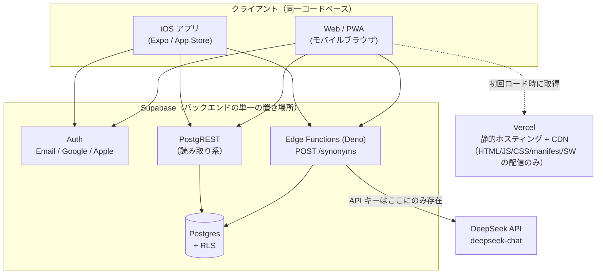
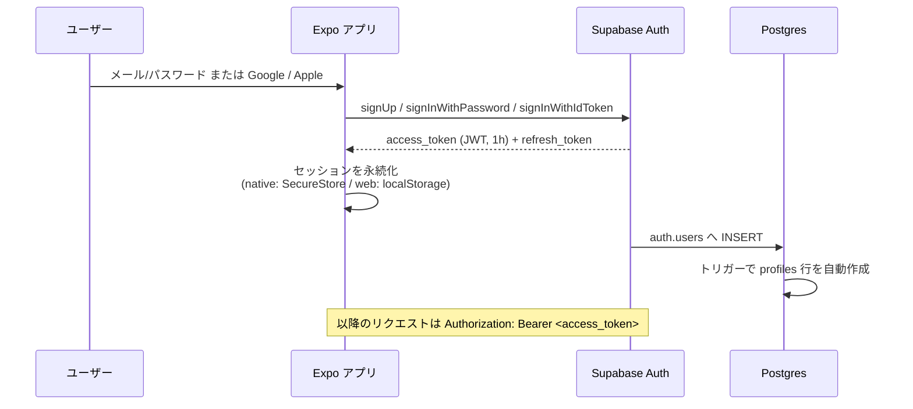
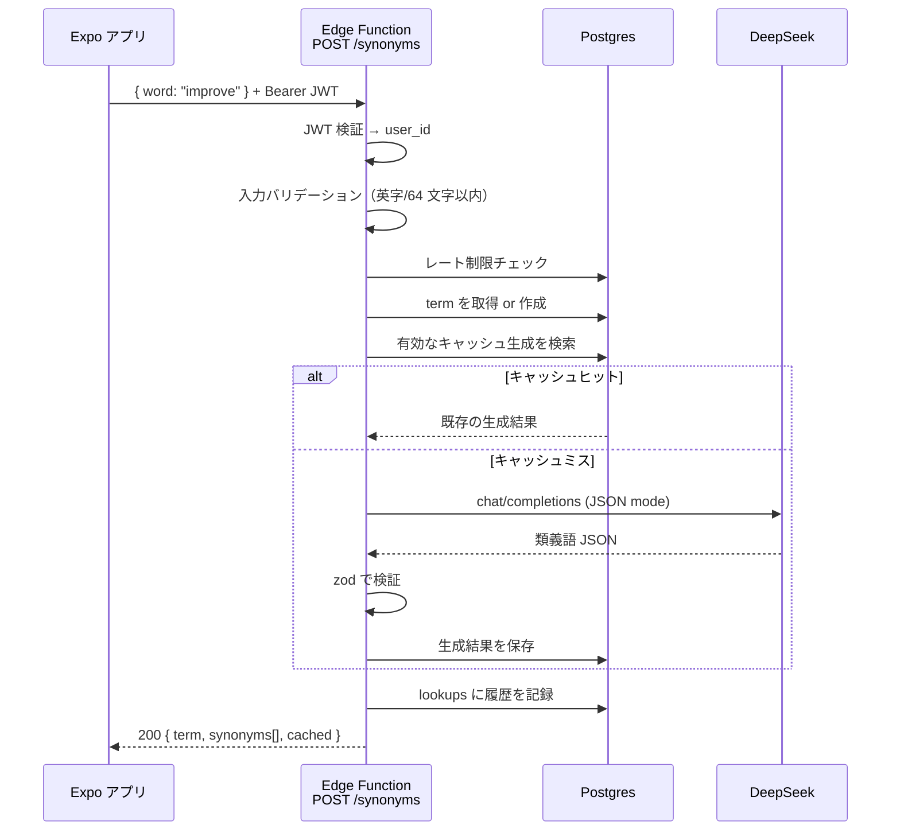

# アーキテクチャ

## 1. 全体像

OpenOwl は「クライアント（Expo アプリ）」「BaaS（Supabase）」「LLM（DeepSeek）」の 3 要素で構成される。
Vercel はこの図の中で**静的アセットの配信者**でしかなく、アプリケーションロジックを持たない。



### 各コンポーネントの責務

| コンポーネント | 責務 | 持たないもの |
| --- | --- | --- |
| Expo アプリ | 画面描画、入力、認証セッション保持、API 呼び出し | ビジネスルール（生成ロジック）、シークレット |
| Vercel | Web/PWA 版の静的ファイル配信、CDN、プレビュー環境 | **API、DB アクセス、シークレット、SSR** |
| Supabase Auth | ID 発行、JWT 発行、OAuth プロバイダ仲介 | プロフィール情報の正典（`profiles` 表が持つ） |
| Supabase Postgres | データの正典、RLS による認可 | 外部 API 呼び出し |
| Supabase Edge Functions | DeepSeek 呼び出し、入力検証、レート制限、生成結果の永続化 | 画面、セッション管理 |
| DeepSeek | 類義語の生成 | 状態（ステートレスに扱う） |

## 2. Vercel と Supabase の役割分担

**方針: Vercel はフロントの配信に限定し、バックエンドは Supabase Edge Functions に一本化する。**
Vercel の API Routes / Serverless Functions / Edge Functions は採用しない
（[ADR-0006](./adr/0006-vercel-frontend-only.md)）。

| 観点 | 判断 |
| --- | --- |
| API の置き場所 | Supabase Edge Functions のみ |
| Vercel の役割 | `frontend/` を `expo export --platform web` した静的成果物（`dist/`）の配信 |
| シークレットの置き場所 | Supabase Edge Functions の Secrets のみ。Vercel には秘密情報を置かない |
| DB へのアクセス経路 | クライアント → PostgREST（読み取り）／ クライアント → Edge Functions（生成） |
| SSR / SSG | 使わない。SPA（静的エクスポート）として配信する |

**なぜ分けるのか**：バックエンドが 2 箇所（Vercel と Supabase）に分かれると、
認証（JWT の検証）・認可（RLS）・シークレット管理が二重化し、
「どちらに書くべきか」の判断が毎回発生する。MVP の規模でこのコストを払う理由がない。
また、Edge Functions は Postgres と同一プロジェクト内にあり、
`service_role` による特権アクセスと RLS の境界が 1 箇所に閉じる。

**なぜ Vercel を使うのか**（Supabase Storage 等での配信ではなく）：
GitHub 連携によるプレビューデプロイ、独自ドメイン、CDN、
`vercel.json` による SPA フォールバック / ヘッダ制御が標準で揃っており、
PWA として配信するうえで追加実装が不要なため。

## 3. リクエストフロー

### 3.1 認証



- **iOS と Web で同一の Supabase プロジェクト**を使うため、同じアカウントで両方にログインできる。
- セッションの永続化先だけがプラットフォームで異なる（詳細は §6）。

### 3.2 類義語生成



キャッシュは**全ユーザー横断**（`terms` 単位）で共有する。
同じ単語を複数ユーザーが引いても DeepSeek への課金は 1 回で済む
（[ADR-0008](./adr/0008-global-generation-cache.md)）。

## 4. レイヤー構成（バックエンド）

Edge Functions はオブジェクト指向で 4 層に分割する。**依存は常に内向き**。

```
Interface (HTTP)   … Request/Response の変換、ステータスコードの決定
      ↓
Application        … ユースケース。手順の調整のみ。技術的詳細を知らない
      ↓
Domain             … Term / SynonymGeneration などのモデルとポート(interface)
      ↑
Infrastructure     … DeepSeek クライアント、Supabase リポジトリ（ポートの実装）
```

`interface`（ポート）は**テストダブル差し替えのためではない**。
本プロジェクトはモック禁止のため、テストは常に実 API に接続する。
この原則はフェーズ 6 でも維持した（[ADR-0016](./adr/0016-unit-tests-limited-to-pure-logic.md)）。
ポートを切る目的は次の 2 点に限られる:

1. Domain / Application が Deno や Supabase SDK に依存しないようにする（依存方向の制御）
2. 将来 LLM プロバイダを差し替える / 併用する際に Application を変更しないで済むようにする

詳細なクラス設計は [`llm-integration.md`](./llm-integration.md) を参照。

## 5. UI / 画面幅の前提

**本プロジェクトの UI はモバイル幅（〜480px 程度）を前提として設計する。**

- 主戦場は iOS ネイティブアプリ。Web/PWA 版は**モバイルブラウザからのアクセスのみを想定**する。
- **PC・タブレットのデスクトップ画面幅に対するレイアウト最適化・レスポンシブ対応は行わない。**
- デスクトップブラウザで開かれた場合の扱いは最低限に留める:
  - ルートに `maxWidth: 480` のコンテナを置き、モバイルレイアウトをそのまま中央寄せで表示する
  - 左右の余白は背景色で埋める
  - これ以上の対応（サイドバー、2 カラム、ホバー前提の UI 等）はしない
- **メディアクエリ / `useWindowDimensions` による大画面向けレイアウト分岐は実装しない**
  （[ADR-0005](./adr/0005-mobile-only-viewport.md)）。
  分岐を 1 箇所でも作ると、以降すべての画面で「大画面のときどうするか」を考える必要が生じ、
  MVP のスコープに対して割に合わない。
- この方針はフェーズ 4（フロントエンド設計）のスタイリング方針を拘束する。
  迷ったら「モバイル幅だけ考えればよい」と判断してよい。

## 6. プラットフォーム差異

iOS ネイティブと Web/PWA で挙動が変わる箇所を列挙する。ここでは差異の所在だけを示す。
**実装レベルの詳細は [`frontend-design.md`](./frontend-design.md) §8〜§10 が正典。**

| 項目 | iOS（ネイティブ） | Web / PWA | 備考 |
| --- | --- | --- | --- |
| Google ログイン | `expo-auth-session` で認可 → `signInWithIdToken` | `signInWithOAuth`（リダイレクト） | OAuth クライアント ID を iOS 用 / Web 用で別々に発行する必要がある |
| Apple ログイン | `expo-apple-authentication`（ネイティブ UI）→ `signInWithIdToken`。**App Store 審査要件のため必須** | Sign in with Apple JS（リダイレクト）。Apple Service ID の設定が別途必要 | ネイティブと Web で Apple 側の設定単位が異なる |
| リダイレクト URL | カスタムスキーム `openowl://auth/callback` | `https://<vercel-domain>/auth/callback` | Supabase Auth の Redirect URLs に両方登録する |
| セッション永続化 | `expo-secure-store`（Keychain） | `localStorage` | SecureStore には値サイズ上限があるため、JWT の保存方式はフェーズ 4 で確定する |
| ディープリンク | `expo-linking` + カスタムスキーム | 通常の URL | Expo Router により両者を同じルート定義で扱う |
| PWA インストール | 該当なし（App Store 経由） | `manifest.webmanifest` + Service Worker | オフライン対応は「キャッシュ済み履歴の閲覧」までに留める |
| プッシュ通知 | 将来検討 | 将来検討 | MVP スコープ外 |

**共通化の方針**: 差異は `frontend/src/infrastructure/` 配下のアダプタに閉じ込め、
画面（`app/`）とドメインロジックはプラットフォームを意識しない。
Expo の `.native.ts` / `.web.ts` によるファイル分割で解決する。

## 7. 非機能要件への対応方針

| 要件 | 方針 | 詳細 |
| --- | --- | --- |
| 拡張性 | `terms` を中心に将来機能をぶら下げる。先回りのテーブル作成はしない | [db-schema.md](./db-schema.md) |
| セキュリティ | DeepSeek キーはサーバー側のみ。全テーブル RLS 有効 | [security.md](./security.md) |
| エラーハンドリング | エラーコードを型で定義し、UI 側でコードごとの復旧手段を出し分ける | [api-spec.md](./api-spec.md) |
| コスト | キャッシュ優先・リトライ最大 1 回・`max_tokens` 固定・プロンプト前方固定 | [llm-integration.md](./llm-integration.md) |
| テスト | モック不使用。単体テストは純粋ロジックのみ、それ以外は実 Supabase に対する E2E が担う | [testing-ci.md](./testing-ci.md) |
