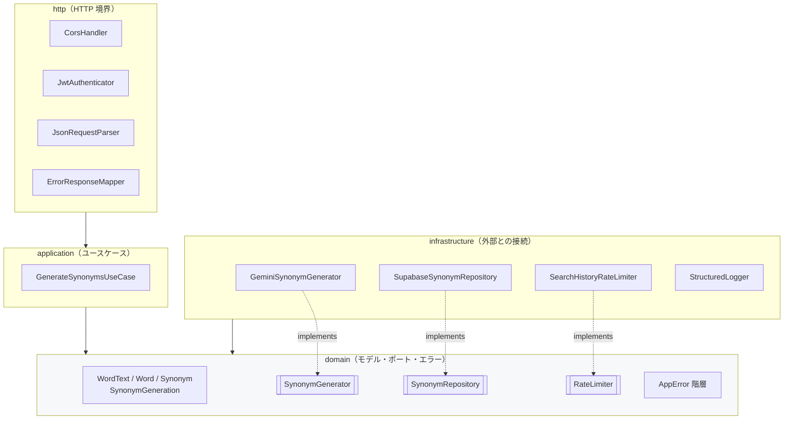
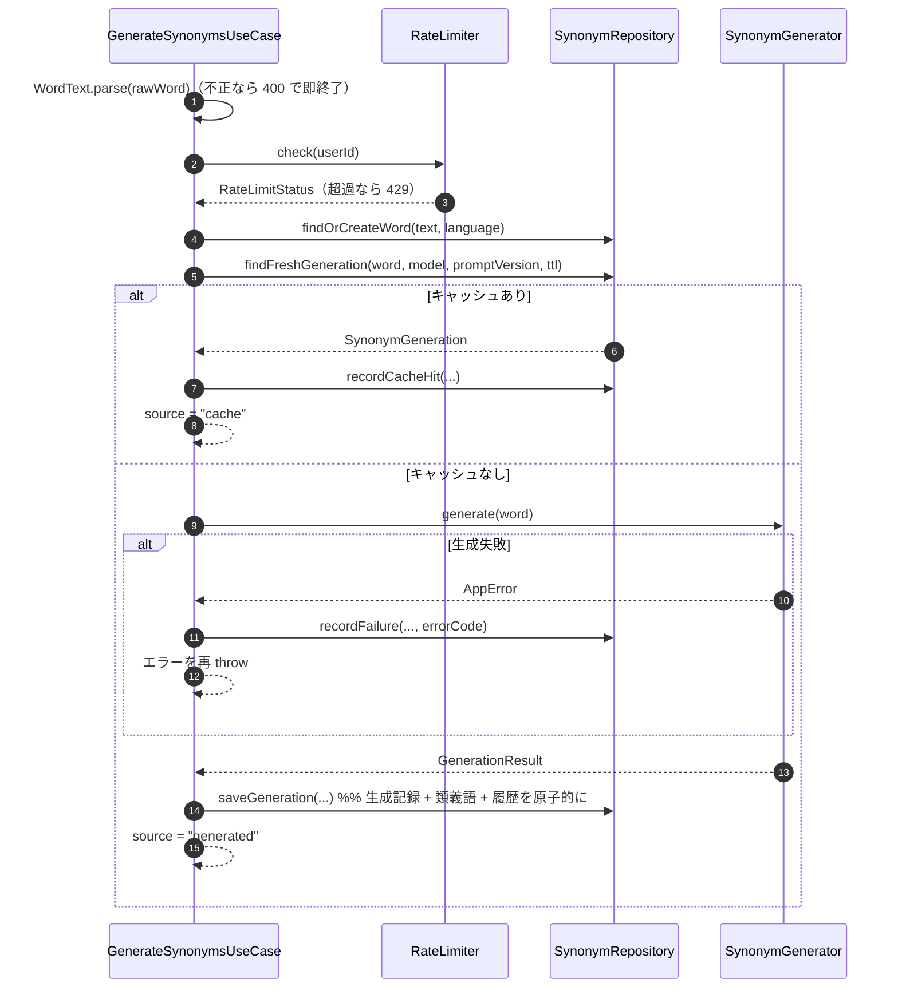

# Edge Functions 設計

対象: `backend/supabase/functions/`（Deno + TypeScript）。
外部から見た仕様は [`api-spec.md`](./api-spec.md)、ここでは**内部構造**を扱います。

> このドキュメントのコードは**設計上のシグネチャ**です。実装は Phase 3（Sonnet 担当）で行います。

## レイヤー構成



**依存の向きは常に内向き（infrastructure → domain）。**
`domain/` は Supabase SDK も `fetch` も知りません。これにより、
LLM プロバイダの変更や永続化方法の変更がユースケースに波及しません。

> ⚠️ **ポート（interface）はプロバイダ差し替えのために定義しています。
> テスト用のフェイク実装を作るための口ではありません。**
> テストは実際の Supabase / Gemini に接続して行います（[ADR-0006](./adr/0006-no-mocks-testing-policy.md)）。

## ディレクトリ構造

```
backend/supabase/functions/
├── deno.json
├── _shared/
│   ├── config/
│   │   └── AppConfig.ts                 # 環境変数の読み込みと検証
│   ├── domain/
│   │   ├── model/
│   │   │   ├── WordText.ts              # 値オブジェクト（正規化 + 検証）
│   │   │   ├── Word.ts
│   │   │   ├── Synonym.ts
│   │   │   ├── SynonymGeneration.ts
│   │   │   └── RateLimitStatus.ts
│   │   ├── port/
│   │   │   ├── SynonymGenerator.ts      # interface（LLM）
│   │   │   ├── SynonymRepository.ts     # interface（永続化）
│   │   │   └── RateLimiter.ts           # interface（利用量制御）
│   │   └── error/
│   │       └── AppError.ts              # エラー階層
│   ├── application/
│   │   └── GenerateSynonymsUseCase.ts
│   ├── infrastructure/
│   │   ├── gemini/
│   │   │   ├── GeminiSynonymGenerator.ts
│   │   │   ├── SynonymPrompt.ts         # プロンプトと応答スキーマ（バージョン付き）
│   │   │   └── GeminiHttpClient.ts      # fetch + タイムアウト + リトライ
│   │   ├── supabase/
│   │   │   ├── SupabaseSynonymRepository.ts
│   │   │   └── SearchHistoryRateLimiter.ts
│   │   └── logging/
│   │       └── StructuredLogger.ts
│   └── http/
│       ├── CorsHandler.ts
│       ├── JwtAuthenticator.ts
│       ├── JsonRequestParser.ts
│       └── ErrorResponseMapper.ts
└── generate-synonyms/
    └── index.ts                          # 合成ルート
```

## ドメインモデル

### `WordText`（値オブジェクト）

単語の正規化と検証を**1箇所に閉じ込める**ための型です。
`string` を関数間で受け渡すと、どこかで正規化を忘れて `words` テーブルに重複行が生まれます。

```ts
export class WordText {
  private constructor(
    readonly value: string,      // 正規化済み（trim + lower）
    readonly raw: string,        // ユーザーの入力そのまま
  ) {}

  /** @throws ValidationError 文字種・長さが不正な場合 */
  static parse(input: string): WordText;

  equals(other: WordText): boolean;
}
```

- 検証ルール: `1〜64文字` かつ `^[A-Za-z][A-Za-z'\- ]*$`（[`security.md`](./security.md#プロンプトインジェクション対策)）。
- **LLM を呼ぶ前に検証する。** 不正入力でトークンを消費しないため。

### `Word` / `Synonym` / `SynonymGeneration`

```ts
export class Word {
  constructor(readonly id: string, readonly text: WordText, readonly language: string) {}
}

export class Synonym {
  constructor(
    readonly term: string,
    readonly partOfSpeech: PartOfSpeech | null,
    readonly definition: string,
    readonly nuance: string,
    readonly sortOrder: number,
    readonly id?: string,        // 永続化前は未確定
  ) {}
}

export class SynonymGeneration {
  constructor(
    readonly id: string,
    readonly word: Word,
    readonly synonyms: readonly Synonym[],
    readonly model: string,
    readonly promptVersion: string,
    readonly generatedAt: Date,
  ) {}

  /** キャッシュとして再利用してよいか（TTL 判定） */
  isFreshAt(now: Date, ttlDays: number): boolean;
}
```

キャッシュの鮮度判定を `SynonymGeneration` 自身に持たせています。
ユースケースやリポジトリに日付計算が散らばるのを防ぐためです。

### エラー階層

```ts
export abstract class AppError extends Error {
  abstract readonly code: ErrorCode;        // api-spec.md のエラーコード
  abstract readonly httpStatus: number;
  abstract readonly retryable: boolean;
  abstract readonly userMessage: string;    // そのまま画面に出せる日本語
}

export class ValidationError        extends AppError {}  // 400 invalid_request
export class UnsupportedLanguageError extends AppError {} // 400 unsupported_language
export class UnauthorizedError      extends AppError {}  // 401 unauthorized
export class NotAKnownWordError     extends AppError {}  // 422 not_a_known_word
export class RateLimitError         extends AppError { readonly retryAfterSeconds: number; }
export class LlmInvalidResponseError extends AppError {} // 502
export class LlmUnavailableError    extends AppError {}  // 503
export class LlmTimeoutError        extends AppError {}  // 504
export class InternalError          extends AppError {}  // 500
```

**エラーが自分の HTTP 表現を知っている**ため、`ErrorResponseMapper` は分岐せずに直列化するだけで済みます。
新しいエラーを追加してもマッパーを触る必要がありません。

## ポート（interface）

```ts
export interface SynonymGenerator {
  readonly model: string;
  readonly promptVersion: string;
  /** @throws LlmTimeoutError | LlmUnavailableError | LlmInvalidResponseError | NotAKnownWordError */
  generate(word: WordText): Promise<GenerationResult>;
}

export interface GenerationResult {
  readonly synonyms: readonly Synonym[];
  readonly promptTokens: number | null;
  readonly completionTokens: number | null;
  readonly latencyMs: number;
}

export interface SynonymRepository {
  findOrCreateWord(text: WordText, language: string): Promise<Word>;
  findFreshGeneration(
    word: Word, model: string, promptVersion: string, ttlDays: number,
  ): Promise<SynonymGeneration | null>;
  /** 生成記録・類義語・検索履歴を 1 トランザクションで保存する */
  saveGeneration(input: SaveGenerationInput): Promise<SynonymGeneration>;
  recordCacheHit(userId: string, word: Word, generationId: string, raw: string): Promise<void>;
  recordFailure(userId: string, word: Word, raw: string, errorCode: string): Promise<void>;
}

export interface RateLimiter {
  /** @throws RateLimitError 上限超過時 */
  check(userId: string): Promise<RateLimitStatus>;   // { dailyLimit, remainingToday }
}
```

ポートを3つに絞った理由: 差し替えの現実的な理由があるのは
**LLM プロバイダ**（Gemini → 別モデル）と**永続化**（Supabase → 別基盤）だけです。
`RateLimiter` は永続化から分けています。制限方式を「DB 集計」から「Redis」等に変えても
`SynonymRepository` に影響を与えないためです。ロガーは interface にせず具象クラスを直接使います
（差し替える理由がなく、抽象化がコストにしかならないため）。

## ユースケース

```ts
export class GenerateSynonymsUseCase {
  constructor(
    private readonly repository: SynonymRepository,
    private readonly generator: SynonymGenerator,
    private readonly rateLimiter: RateLimiter,
    private readonly logger: StructuredLogger,
    private readonly config: AppConfig,
  ) {}

  async execute(command: GenerateSynonymsCommand): Promise<GenerateSynonymsResult>;
}

export interface GenerateSynonymsCommand {
  readonly userId: string;     // JWT から取得済みの値のみを受け取る
  readonly rawWord: string;
  readonly language: string;
  readonly requestId: string;
}
```

### 処理順序



**順序の意図**:

- 入力検証 → レート制限 → キャッシュ → LLM の順。
  **お金のかからないチェックを先に置き、LLM 呼び出しを最後にします。**
- 失敗も `recordFailure` で記録します。これがレート制限のカウント対象になるため、
  失敗を繰り返すことで無制限に LLM を呼ぶ経路を塞げます。

## Gemini 連携

### クラス構成

```ts
export class GeminiSynonymGenerator implements SynonymGenerator {
  readonly model: string;
  readonly promptVersion = SynonymPrompt.VERSION;   // 'v1'

  constructor(
    private readonly http: GeminiHttpClient,
    private readonly prompt: SynonymPrompt,
    model: string,
  ) { this.model = model; }

  async generate(word: WordText): Promise<GenerationResult> {
    // 1. prompt.buildRequest(word) でリクエストボディを組み立てる
    // 2. http.post(model, body) を呼ぶ（タイムアウト・リトライは HttpClient の責務）
    // 3. prompt.parseResponse(json) で検証し、Synonym[] に変換する
  }
}

/** HTTP・タイムアウト・リトライ・エラー分類のみを担当する */
export class GeminiHttpClient {
  constructor(private readonly apiKey: string, private readonly timeoutMs: number) {}
  post(model: string, body: unknown): Promise<GeminiRawResponse>;
}

/** プロンプト本文・応答スキーマ・応答の検証を担当する（バージョン管理の単位） */
export class SynonymPrompt {
  static readonly VERSION = 'v1';
  buildRequest(word: WordText): GeminiRequestBody;
  /** @throws LlmInvalidResponseError | NotAKnownWordError */
  parseResponse(raw: GeminiRawResponse): readonly Synonym[];
}
```

「HTTP の面倒（`GeminiHttpClient`）」と「プロンプトの面倒（`SynonymPrompt`）」を分けているのは、
プロンプト改訂の頻度が通信処理より圧倒的に高いためです。
`SynonymPrompt.VERSION` を上げると、`synonym_generations.prompt_version` の違いにより
**キャッシュが自動的に無効化**され、新プロンプトで再生成されます。

### リクエスト仕様

`POST https://generativelanguage.googleapis.com/v1beta/models/{model}:generateContent`
（ヘッダ `x-goog-api-key: $GEMINI_API_KEY`）

```jsonc
{
  "systemInstruction": { "parts": [{ "text": "<システム指示。約60トークン>" }] },
  "contents": [{ "role": "user", "parts": [{ "text": "happy" }] }],
  "generationConfig": {
    "temperature": 0.3,
    "maxOutputTokens": 800,
    "responseMimeType": "application/json",
    "responseSchema": {
      "type": "object",
      "properties": {
        "isKnownWord": { "type": "boolean" },
        "synonyms": {
          "type": "array",
          "items": {
            "type": "object",
            "properties": {
              "term":          { "type": "string" },
              "partOfSpeech":  { "type": "string",
                                 "enum": ["noun","verb","adjective","adverb","other"] },
              "definition":    { "type": "string" },
              "nuance":        { "type": "string" }
            },
            "required": ["term", "partOfSpeech", "definition", "nuance"],
            "propertyOrdering": ["term", "partOfSpeech", "definition", "nuance"]
          }
        }
      },
      "required": ["isKnownWord", "synonyms"]
    },
    "thinkingConfig": { "thinkingBudget": 0 }
  }
}
```

**システム指示（v1、要旨）**

```
You are an English thesaurus for Japanese learners.
Return exactly 5 common synonyms of the given English word.
Write "definition" and "nuance" in Japanese, each within 40 characters.
"nuance" must explain how it differs from the input word.
If the input is not an English word, set isKnownWord to false and return an empty array.
```

### コストを抑えるための設計判断

| 判断 | 理由 |
| --- | --- |
| `thinkingConfig.thinkingBudget = 0` | Flash-Lite の推論トークンを消費させない。類義語列挙に段階的推論は不要 |
| `responseSchema` による構造化出力 | 出力形式の説明をプロンプト本文から追い出せる（毎回の入力トークンが減る） |
| `maxOutputTokens: 800` | 5件×（語 + 品詞 + 日本語40字×2）に対する上限。暴走出力を止める |
| `temperature: 0.3` | 出力を安定させ、再生成の必要を減らす |
| 出力を日本語40字以内に制限 | 出力トークン数の抑制。UI 上も長文は読まれない |
| ユーザー横断キャッシュ | 同じ単語は全ユーザーで1回しか生成しない（[ADR-0007](./adr/0007-shared-synonym-cache.md)） |
| リトライは最大1回、対象を限定 | 下記参照 |

### タイムアウトとリトライ

```
タイムアウト: 10 秒（AbortController、環境変数で調整可）
リトライ:     最大 1 回（合計 2 回の呼び出しまで）
```

| Gemini からの結果 | リトライ | 理由 |
| --- | --- | --- |
| ネットワークエラー | ✅ する | 一過性の可能性が高い。トークンは消費していない |
| 429 / 5xx | ✅ する（500ms + ジッタ後） | 同上 |
| タイムアウト | ❌ しない | 既に10秒待っている。再試行すると体感20秒になり UX が壊れる |
| 400 系（不正リクエスト） | ❌ しない | 再送しても必ず同じ結果。設定・実装の問題 |
| スキーマ不適合の応答 | ❌ しない | 再生成に**フル課金が発生する**。502 で返し、ログから原因を追う |

## 認証と HTTP 境界

```ts
export class JwtAuthenticator {
  constructor(private readonly supabaseUrl: string, private readonly publishableKey: string) {}
  /** @throws UnauthorizedError */
  async authenticate(request: Request): Promise<AuthenticatedUser>;  // { id }
}
```

- `Authorization` ヘッダの JWT を `auth.getUser(jwt)` で検証し、**ユーザー ID をサーバ側で確定**します。
- `config.toml` の `verify_jwt = true` と合わせた二重チェックです。
- **リクエストボディのユーザー識別子は受け付けません**（[`api-spec.md`](./api-spec.md)）。

## 合成ルート（`generate-synonyms/index.ts`）

DI コンテナは使わず、起動時に依存を組み立てます。
**依存関係が1画面で読めること**を優先します。

```ts
const config = AppConfig.fromEnv();                 // 起動時に環境変数を検証。欠けていれば即座に失敗
const logger = new StructuredLogger('generate-synonyms');
const admin = createClient(config.supabaseUrl, config.serviceRoleKey, {
  auth: { persistSession: false },
});

const useCase = new GenerateSynonymsUseCase(
  new SupabaseSynonymRepository(admin),
  new GeminiSynonymGenerator(
    new GeminiHttpClient(config.geminiApiKey, config.geminiTimeoutMs),
    new SynonymPrompt(),
    config.geminiModel,
  ),
  new SearchHistoryRateLimiter(admin, config.rateLimit),
  logger,
  config,
);

Deno.serve(async (request) => {
  // CorsHandler → JwtAuthenticator → JsonRequestParser → useCase.execute → 直列化
  // 例外はすべて ErrorResponseMapper に集約する
});
```

- `AppConfig.fromEnv()` は**起動時に**必須変数の存在を検証します。
  設定漏れをリクエスト時ではなくデプロイ直後に検知するためです。
- Supabase クライアントとユースケースはモジュールスコープで1度だけ生成し、
  ウォームなインスタンス間で再利用します（コールドスタートの削減）。

## ロギング

`StructuredLogger` は JSON 1行を `console.log` に出します。出力するのは**明示したフィールドのみ**です。

```jsonc
{
  "requestId": "…", "userId": "…", "function": "generate-synonyms",
  "word": "happy", "source": "generated", "model": "gemini-2.5-flash-lite",
  "promptVersion": "v1", "latencyMs": 812,
  "promptTokens": 71, "completionTokens": 240,
  "outcome": "succeeded", "errorCode": null
}
```

- **JWT・API キー・リクエストボディ全体・LLM の生応答は出力しません。**
- トークン数を毎回記録することで、`synonym_generations` の集計と合わせてコストを追跡できます。
- エラー時は `errorCode` と `requestId` を出し、クライアントに返す `requestId` と突き合わせられるようにします。

## 実装フェーズ（Phase 3）の完了条件

1. `supabase db reset` でマイグレーションが通り、[`security.md`](./security.md#rls-の検証phase-3-の完了条件) の RLS 検証6項目が実 DB で確認できる
2. `supabase functions serve` でローカル起動し、**実際の Gemini API** に対して成功パスが通る
3. 異常系（不正入力・未認証・レート超過・LLM 障害）が [`api-spec.md`](./api-spec.md) 通りのステータスとコードを返す
4. 同じ単語の2回目のリクエストが `source: "cache"` になり、**LLM が呼ばれない**ことをログで確認できる
5. `deno lint` / `deno check` がエラーなしで通る
