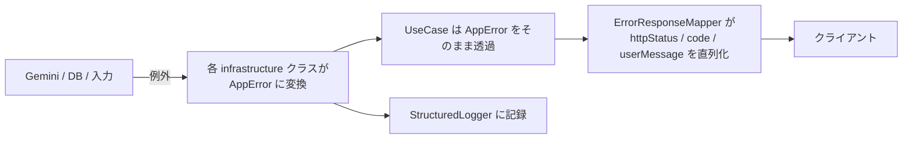

# エラーハンドリングとフォールバック UX

LLM を使う機能は「たまに失敗する」ことを前提に設計します。
本ドキュメントは、**どのエラーを・誰が・どう扱うか**を一箇所に定めます。

## 設計原則

1. **失敗を握りつぶさない。** どのエラーも分類され、コードが付き、ログに残る。
2. **リトライは「意味があるときだけ、最小限。」** LLM の再呼び出しは課金に直結する。
3. **自動リトライはサーバ側で1回まで。クライアントの自動リトライも1回まで。** 合わせても最大4回の呼び出しにはしない。
4. **ユーザーを行き止まりにしない。** 失敗時は必ず「次にできること」（再試行 / 過去の結果を見る / 待つ）を提示する。

## エラー分類と責務

| コード | HTTP | 分類 | サーバの振る舞い | クライアントの振る舞い |
| --- | --- | --- | --- | --- |
| `invalid_request` | 400 | ユーザー入力 | LLM を呼ばずに拒否。`search_history` にも残さない | 入力欄の下にインラインで理由を表示。**送信前に同じルールで検証**して発生自体を減らす |
| `unsupported_language` | 400 | ユーザー入力 | 同上 | 「現在は英単語のみ対応」を表示 |
| `unauthorized` | 401 | 認証 | 処理しない | セッション更新を1度試み、それでも失敗ならログイン画面へ遷移 |
| `not_a_known_word` | 422 | ユーザー入力 | `search_history` に `failed` で記録（レート制限に計上） | 「英単語として認識できませんでした」+ スペル確認の促し。**再試行ボタンは出さない** |
| `rate_limited`（1日の上限） | 429 | 制限 | LLM を呼ばない。`retryAfterSeconds`（数時間）を返す | 残り時間を表示し、生成ボタンを無効化。履歴の閲覧を促す |
| `rate_limited`（毎分バースト） | 429 | 制限 | LLM を呼ばない。`retryAfterSeconds`（60秒）を返す | 短い待機を表示。**「本日の上限」と誤解させる文言を出さない** |
| `llm_output_truncated` | 502 | モデル/設定 | 出力がトークン上限で切れた。`finishReason` をログに残す。**リトライしない** | 「別の単語でお試しください」。**再試行ボタンを出さない**（決定的に再発する） |
| `llm_timeout` | 504 | 一過性 | サーバ側リトライなし（既に待機済み） | 「時間がかかっています」+ 再試行ボタン（手動のみ） |
| `llm_unavailable` | 503 | 一過性 | 429/5xx/ネットワークは**1回だけ**再試行 | 再試行ボタン + 過去の結果へのフォールバック |
| `llm_invalid_response` | 502 | 実装/モデル | 再試行しない（フル課金が発生するため）。`requestId` 付きでログ | 再試行ボタン（手動）。頻発するならプロンプト側の問題としてログから調査 |
| `internal_error` | 500 | 想定外 | スタックはログのみ。詳細はレスポンスに出さない | 汎用メッセージ + 再試行ボタン。`requestId` を小さく表示 |
| （ネットワーク到達不可） | — | 端末側 | — | オフライン表示。生成ボタンを無効化し、**その起動中に取得済みの**履歴を表示 |

## サーバ側（Edge Functions）

### エラーの発生源と変換



- **例外を AppError に変換するのは infrastructure 層の責務**です。
  ユースケースが `fetch` の失敗や PostgREST のエラーコードを知る必要はありません。
- 想定外の例外（`AppError` でないもの）は最上位で `InternalError` に包み、
  **元のメッセージをクライアントへ返しません**（内部情報の漏洩防止）。
- どのエラーでも `requestId` をレスポンスとログの両方に含め、突き合わせ可能にします。

### 失敗の記録

- LLM 呼び出しに到達した後の失敗は `synonym_generations`（`status='failed'`, `error_code`）と
  `search_history`（`outcome='failed'`）の両方に記録します。
- **LLM に到達する前の失敗（入力検証・レート制限・認証）は記録しません。**
  課金もリソース消費も発生しておらず、記録するとノイズになるためです。

### サーバ側リトライの範囲（再掲）

| 事象 | リトライ |
| --- | --- |
| ネットワークエラー / 429 / 5xx | ✅ 1回のみ（500ms + ジッタ） |
| タイムアウト | ❌ |
| 4xx（不正リクエスト） | ❌ |
| スキーマ不適合の応答 | ❌ |
| **2xx で返った本文が壊れた JSON だった** | ❌ この時点で生成は課金済みのため、再送は純粋な二重課金になる |
| **出力がトークン上限で切り詰められた** | ❌ 同じ入力では決定的に再発する |

## クライアント側（React Native）

### 通信レイヤーの方針

`@tanstack/react-query` の `useMutation` を使い、**リトライ判定を1箇所に集約**します。

```ts
// 概念コード（実装は Phase 5）
useMutation({
  mutationFn: (word: string) => synonymApi.generate(word),
  retry: (failureCount, error) =>
    error instanceof ApiError &&
    error.retryable &&
    error.code !== 'rate_limited' &&   // 待ち時間が長いため自動再送しない
    failureCount < 1,
  retryDelay: 800,
});
```

- **`retryable: false` のエラーは絶対に自動リトライしない。**
- `rate_limited` は `retryable: true` だが、`retryAfterSeconds` が数分〜数時間のため
  **自動リトライの対象から除外**し、待機時間を UI に出します。
- 生成ボタンは送信中に必ず無効化します（二重送信＝二重課金の防止）。

### 画面上のフォールバック

| 状況 | 画面 |
| --- | --- |
| 生成中 | ボタンを無効化しスピナー表示。3秒を超えたら「生成中です…」の補足を出す |
| 一過性の失敗（503/504/500/502） | エラーバナー + 「もう一度試す」ボタン。**入力した単語は消さない** |
| 過去に同じ単語を検索済み | 「前回の結果を表示」リンクを出し、`search_history` から取得した結果を見せる |
| レート制限 | 「本日の上限に達しました（あとN分で回復）」。生成ボタンを無効化。履歴タブへ誘導 |
| オフライン | 上部にオフラインバナー。生成ボタン無効化。履歴はメモリ上のキャッシュから表示（下記の注記を参照） |
| 認証切れ | 自動でセッション更新を1回試行。失敗時のみログイン画面へ |

> **オフライン時に見える履歴の範囲**: クエリキャッシュのディスク永続化は MVP では行いません
> （[`frontend/state-management.md`](./frontend/state-management.md#4-オフラインの扱い)）。
> そのため「アプリ起動後に一度でも取得した履歴」はオフラインでも見られますが、
> **起動直後からオフラインの場合は履歴を表示できません**。

**「過去の結果へのフォールバック」が UX 上の要**です。
`search_history` には単語と生成結果が紐付いて保存されているため（[`db-schema.md`](./db-schema.md)）、
LLM が落ちていても、一度引いた単語については学習を継続できます。

### エラーメッセージの原則

- 日本語で、**ユーザーが次に取れる行動**を含める。
- 技術用語（HTTP ステータス、API 名、モデル名）を出さない。
- `requestId` は問い合わせのために小さく表示するに留める。

| コード | 表示文言（案） |
| --- | --- |
| `invalid_request` | 英単語を1つ入力してください（英字のみ、64文字以内）。 |
| `unsupported_language` | 現在は英単語のみに対応しています。 |
| `not_a_known_word` | 英単語として認識できませんでした。スペルをご確認ください。 |
| `rate_limited`（1日） | 本日の生成回数の上限に達しました。保存済みの履歴はいつでも見返せます。 |
| `rate_limited`（毎分） | リクエストが短時間に集中しています。少し待ってからお試しください。 |
| `llm_output_truncated` | この単語の結果を取得できませんでした。別の単語でお試しください。 |
| `llm_timeout` | 生成に時間がかかっています。もう一度お試しください。 |
| `llm_unavailable` | ただいま混み合っています。少し時間をおいてお試しください。 |
| `llm_invalid_response` | 結果をうまく取得できませんでした。もう一度お試しください。 |
| `internal_error` | エラーが発生しました。もう一度お試しください。 |
| オフライン | オフラインです。接続を確認してください。 |

## 監視（Phase 3 以降の運用）

`synonym_generations` と Edge Function のログから、以下を定期的に確認します。
専用の監視基盤は MVP では導入しません（Supabase のログとテーブル集計で足ります）。

| 指標 | 求め方 | 注意する水準 |
| --- | --- | --- |
| 失敗率 | `status='failed'` の割合 | 5% を超えたら調査 |
| キャッシュヒット率 | `search_history` の `outcome='cache'` 比率 | 低すぎる場合はキャッシュ TTL / prompt_version の見直し |
| 平均出力トークン | `avg(completion_tokens)` | 想定（〜300）から乖離したらプロンプトを確認 |
| `llm_invalid_response` 件数 | `error_code` 別集計 | 0 が正常。発生したらプロンプト or スキーマの不整合 |
| p95 レイテンシ | `latency_ms` | 5秒超が続くならタイムアウト値と UI の文言を見直す |
