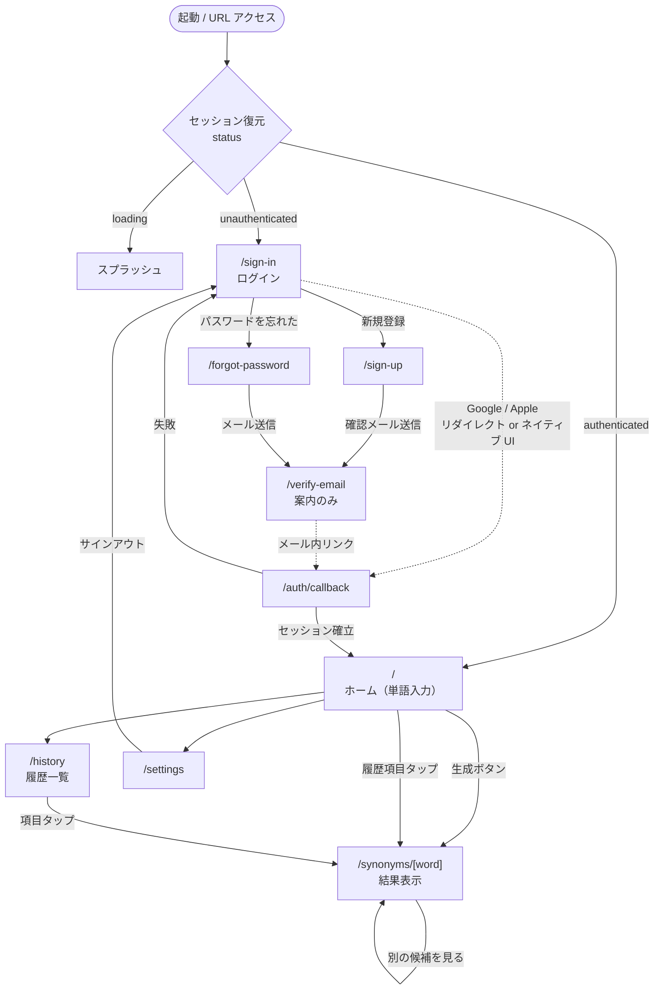

# フロントエンド設計

対象: `frontend/`（Expo アプリ。iOS ネイティブ + Web/PWA）。
本ドキュメントは**設計**であり、実装はフェーズ 5 で行う。

前提となる確定事項:

- UI は**モバイル幅（〜480px）のみ**を対象とする（[ADR-0005](./adr/0005-mobile-only-viewport.md)）
- ルーティングは Expo Router（[ADR-0003](./adr/0003-expo-router.md)）
- サーバー状態は TanStack Query、クライアント状態は Zustand（[ADR-0004](./adr/0004-state-management.md)）
- 読み取りは PostgREST 直接、生成のみ Edge Function（[ADR-0009](./adr/0009-read-path-via-postgrest.md)）
- API 契約の正典は [`api-spec.md`](./api-spec.md)

## 1. スコープ

MVP に含む画面は**認証**と**類義語生成**を成立させるために最小限必要なものに限る。

| 含む | 含まない（将来） |
| --- | --- |
| サインアップ / ログイン（Email, Google, Apple） | 単語帳（類義語の個別保存） |
| パスワードリセット | 例文生成 |
| 単語入力 → 類義語生成 → 結果表示 | ロールプレイ会話 |
| 検索履歴の一覧・再表示・削除 | 復習スケジュール / 通知 |
| プロフィール（表示名）とサインアウト | ダークテーマ、アプリ内多言語切替 |

**履歴画面を MVP に含める理由**: 「生成結果を DB に保存する」という要件が
ユーザーから観測できる唯一の出口であり、これがないと保存の成否を確認できない。
一方で「個々の類義語を保存する」（単語帳）は含めない。

## 2. 画面構成と遷移



### 2.1 画面ごとの責務

| ルート | 画面 | 主な要素 | データ源 |
| --- | --- | --- | --- |
| `/sign-in` | ログイン | メール/パスワード、Google、Apple | `supabase.auth` |
| `/sign-up` | サインアップ | メール/パスワード、規約表示 | `supabase.auth` |
| `/forgot-password` | パスワード再設定要求 | メール入力 | `supabase.auth` |
| `/verify-email` | 案内 | 「確認メールを送信しました」 | なし（静的） |
| `/auth/callback` | コールバック | スピナーのみ。成功で `/` へ置換遷移 | `supabase.auth` |
| `/` | ホーム | 単語入力、生成ボタン、直近 5 件の履歴 | 入力=ローカル / 履歴=PostgREST |
| `/synonyms/[word]` | 結果 | 類義語カード一覧、状態バッジ、再生成 | Edge Function or PostgREST（§5.3） |
| `/history` | 履歴 | 一覧（新しい順）、スワイプ削除 | PostgREST |
| `/settings` | 設定 | 表示名、母語、サインアウト、アカウント削除導線なし | PostgREST |

**`/synonyms/[word]` を独立ルートにする理由**: PWA では結果に URL が付くことに実利がある
（再読み込み・共有・戻る操作）。ホーム内にインライン表示すると、リロードで結果が消え、
ブラウザバックがアプリの外に出てしまう。

## 3. ルーティング設計

Expo Router のファイル構成。ルート定義は薄く保ち、画面の中身は `src/features/` に置く。

```
frontend/app/
├── _layout.tsx              # Providers（QueryClient / SafeArea / MobileFrame）+ セッション購読
├── +not-found.tsx
├── (auth)/
│   ├── _layout.tsx          # 認証済みなら "/" へ Redirect
│   ├── sign-in.tsx
│   ├── sign-up.tsx
│   ├── forgot-password.tsx
│   └── verify-email.tsx
├── auth/
│   └── callback.tsx         # ルートグループに入れない（実 URL /auth/callback が必要）
└── (app)/
    ├── _layout.tsx          # 未認証なら "/sign-in" へ Redirect
    ├── index.tsx            # ホーム
    ├── history.tsx
    ├── settings.tsx
    └── synonyms/
        └── [word].tsx
```

**`auth/callback` をグループに入れない理由**: ルートグループ `(auth)` は URL に現れないため
`/sign-in` になるが、OAuth のリダイレクト URL は Supabase 管理画面と Apple/Google 側に
**固定文字列として登録済み**である必要がある。`app/auth/callback.tsx` にすることで
URL が `/auth/callback` に固定され、[deployment.md](./deployment.md) §2.3 の登録内容と一致する。

### 3.1 認証ガード

ガードは 2 つのレイアウトに閉じ込め、各画面には書かない。

```tsx
// app/(app)/_layout.tsx（設計。実装はフェーズ 5）
const status = useAuthStatus();
if (status === 'loading') return <SplashScreen />;
if (status === 'unauthenticated') return <Redirect href="/sign-in" />;
return <Stack />;
```

`status === 'loading'` の間に `Redirect` を返さないことが重要。
セッション復元前にリダイレクトすると、リロードのたびにログイン画面が一瞬見える。

## 4. ディレクトリ構造

**結論: feature-based を主軸とし、feature 内部を必要な層だけに分ける**
（[ADR-0010](./adr/0010-feature-based-frontend-structure.md)）。

```
frontend/
├── app/                                 # ルート定義のみ（上記 §3）
├── src/
│   ├── features/
│   │   ├── auth/
│   │   │   ├── application/
│   │   │   │   ├── useSignInWithPassword.ts
│   │   │   │   ├── useSignInWithGoogle.ts
│   │   │   │   ├── useSignInWithApple.ts
│   │   │   │   └── useSignOut.ts
│   │   │   ├── infrastructure/
│   │   │   │   ├── SupabaseAuthGateway.ts
│   │   │   │   ├── GoogleAuthProvider.native.ts
│   │   │   │   ├── GoogleAuthProvider.web.ts
│   │   │   │   ├── AppleAuthProvider.native.ts
│   │   │   │   └── AppleAuthProvider.web.ts
│   │   │   ├── ui/
│   │   │   │   ├── EmailPasswordForm.tsx
│   │   │   │   └── SocialSignInButtons.tsx
│   │   │   └── authStore.ts             # Zustand（セッションのみ）
│   │   ├── synonyms/
│   │   │   ├── domain/
│   │   │   │   ├── WordInput.ts         # 入力の正規化・検証（サーバーと同じ規則）
│   │   │   │   └── SynonymResult.ts     # レスポンスのドメイン表現
│   │   │   ├── application/
│   │   │   │   ├── useGenerateSynonyms.ts
│   │   │   │   └── useStoredSynonyms.ts
│   │   │   ├── infrastructure/
│   │   │   │   ├── SynonymsApi.ts       # port（interface）
│   │   │   │   └── EdgeFunctionSynonymsApi.ts
│   │   │   └── ui/
│   │   │       ├── WordField.tsx
│   │   │       ├── SynonymCard.tsx
│   │   │       └── GenerationStateBadge.tsx
│   │   ├── history/
│   │   │   ├── application/useLookups.ts
│   │   │   ├── application/useDeleteLookup.ts
│   │   │   ├── infrastructure/LookupsApi.ts
│   │   │   └── ui/LookupRow.tsx
│   │   └── profile/
│   │       ├── application/useProfile.ts
│   │       ├── infrastructure/ProfileApi.ts
│   │       └── ui/ProfileForm.tsx
│   └── shared/
│       ├── supabase/
│       │   ├── client.ts                # createClient（単一インスタンス）
│       │   ├── SessionStorage.native.ts # 分割 SecureStore アダプタ（§9）
│       │   └── SessionStorage.web.ts
│       ├── api/
│       │   ├── ApiError.ts              # サーバーの code に対応するエラー型
│       │   └── parseErrorResponse.ts
│       ├── query/
│       │   ├── queryClient.ts
│       │   └── queryKeys.ts
│       ├── ui/                          # Button / TextField / Card / Toast / MobileFrame
│       └── theme/tokens.ts
├── public/                              # Web 専用（manifest / sw.js / icons）
├── app.config.ts
└── vercel.json
```

### 4.1 なぜ feature-based か

フェーズ 1 の [`repository-structure.md`](./repository-structure.md) は
`src/{domain,application,infrastructure,ui}` という層優先の案を素描していたが、
フェーズ 4 で feature 優先に変更する。理由:

1. **将来機能が「機能」単位で増えることが確定している。**
   ロードマップに単語帳・例文生成・ロールプレイ会話が並んでいる
   （[roadmap.md](./roadmap.md)）。層優先だと 1 機能追加のたびに 4 つの既存
   ディレクトリすべてに手が入り、レビューの差分が横に広がる。
   feature 優先なら 1 ディレクトリの追加で完結する。
2. **削除しやすさ。** 機能を落とすときにディレクトリごと消せる。
   層優先では 4 箇所から関連ファイルを探し出す必要がある。
3. **ツリーを見ればアプリが何をするか分かる。**

### 4.2 CLAUDE.md の「4 層・依存は内向き」との整合

feature 優先にしても層は消さない。feature 内で `domain → application → infrastructure`
の依存方向を保つ。フロントエンドでは最外層が HTTP ではなく **UI（`app/` と `ui/`）**になる:

```
domain          … 正規化・検証・表示のためのモデル。React も Supabase も知らない
   ↑
application     … ユースケース。React Query の hook として公開する
   ↑
infrastructure  … Supabase / fetch / SecureStore。port(interface)を実装する
   ↑
ui / app        … 画面。application の hook だけを呼ぶ
```

**空の層ディレクトリは作らない。** 例えば `auth` feature に `domain/` は作らない
（検証もセッション管理も Supabase Auth 側の責務で、こちらに固有のドメイン規則がない）。
層が要らない feature に層を切るのは、CLAUDE.md の意図（依存方向の制御）ではなく
儀式になる。

依存方向は ESLint の `import/no-restricted-paths` で機械的に強制する
（`ui` → `infrastructure` の直接 import、feature 間の相互 import を禁止）。
ディレクトリの深さではなく lint で守る。

## 5. 状態管理

### 5.1 全体像

| 状態 | 置き場所 | 理由 |
| --- | --- | --- |
| 認証セッション | Zustand（`authStore`） | グローバルかつ小さい。更新頻度が低い |
| 検索履歴・プロフィール | TanStack Query | サーバー由来。キャッシュ・再取得・失効が要る |
| 類義語の生成結果 | TanStack Query の **mutation** | 副作用と課金を伴う（§5.2） |
| 入力中の単語、開閉状態 | コンポーネントの `useState` | 画面ローカル |

**サーバー由来のデータを Zustand に写さない**（[ADR-0004](./adr/0004-state-management.md)）。
二重管理になり、必ず同期がずれる。

### 5.2 認証セッション

セッションを書き込むのは**アプリ全体で 1 箇所だけ**にする。

```ts
// src/features/auth/authStore.ts（設計）
type AuthState = {
  status: 'loading' | 'authenticated' | 'unauthenticated';
  session: Session | null;
  userId: string | null;
};
```

`app/_layout.tsx` にマウントした購読器が次を行う:

1. 起動時に `supabase.auth.getSession()` を 1 回呼び、`status` を確定させる
2. `supabase.auth.onAuthStateChange` を購読し、以後の変化を store に流す
3. サインアウト時に `queryClient.clear()` を呼ぶ
   — **前のユーザーのキャッシュが次のユーザーに見えるのを防ぐため**。
   RLS があるのでサーバーからは取れないが、ローカルのキャッシュは別問題。

コンポーネントから `supabase.auth.setSession` 等を直接呼ばない。

### 5.3 類義語生成 — query ではなく mutation

**`useQuery` を使ってはならない**（[ADR-0012](./adr/0012-generation-as-mutation.md)）。
`useQuery` はフォーカス復帰・再マウント・再接続で自動再取得するため、
ユーザーが押していないのに DeepSeek が呼ばれ、課金とレート制限を消費する。

```ts
// src/features/synonyms/application/useGenerateSynonyms.ts（設計）
useMutation({
  mutationFn: (input: GenerateInput) => synonymsApi.generate(input),
  retry: false,                         // 自動再試行しない（§7 のコード別方針に従う）
  onSuccess: (result) => {
    queryClient.invalidateQueries({ queryKey: queryKeys.lookups() });
    if (result.generation.id) {
      queryClient.setQueryData(queryKeys.storedSynonyms(result.term.text), result);
    }
  },
});
```

### 5.4 結果画面への到達経路が 2 つあることへの対応

`/synonyms/improve` には 2 通りの入り方がある。

| 経路 | 挙動 |
| --- | --- |
| ホームで生成ボタンを押して遷移 | mutation の結果をそのまま表示 |
| URL 直接アクセス / リロード / 履歴タップ | **生成せず**、PostgREST から自分の過去の結果を読む |

直接アクセスで自動生成しないのは、URL を開くだけで課金が発生する状態を避けるため。
過去の結果が無い場合は結果を出さず、「この単語を生成する」ボタンを表示して
明示的な操作を求める。

```ts
// useStoredSynonyms（設計）: 自分の直近の lookup を 1 件引く
supabase
  .from('lookups')
  .select('id, created_at, terms!inner(id, display_text, language), synonym_generations(...)')
  .eq('terms.normalized_text', normalized)
  .order('created_at', { ascending: false })
  .limit(1);
```

`lookups.generation_id` は `ON DELETE SET NULL` なので `synonym_generations` が
`null` になりうる。その場合は「保存されていない結果」として扱い、生成ボタンを出す。

### 5.5 クエリキー

文字列の直書きを禁止し、1 モジュールに集約する。

```ts
// src/shared/query/queryKeys.ts（設計）
export const queryKeys = {
  lookups: () => ['lookups'] as const,
  storedSynonyms: (word: string) => ['storedSynonyms', word.toLowerCase()] as const,
  profile: () => ['profile'] as const,
};
```

`userId` をキーに含めない。RLS が行を絞るため不要で、
サインアウト時に `queryClient.clear()` する方針（§5.2）と重複するため。

### 5.6 QueryClient の既定値

| オプション | 値 | 理由 |
| --- | --- | --- |
| `staleTime`（履歴） | 30 秒 | 画面往復のたびに再取得しない |
| `gcTime` | 5 分 | 既定のまま |
| `retry`（query） | 1 回 | 一時的なネットワーク断を吸収 |
| `retry`（mutation） | `false` | 生成の自動再試行は課金に直結する |
| `refetchOnWindowFocus` | `true`（query のみ） | PWA でタブ復帰時に履歴を更新 |

## 6. API アクセス層

各 feature の `infrastructure/` に port（interface）とその実装を置く。
画面は port の型だけを見る。バックエンドと同じく、
**interface はテストダブル差し替えのためではなく依存方向の制御のために存在する**
（モックは使わない。§12）。

```ts
// src/features/synonyms/infrastructure/SynonymsApi.ts（設計）
export interface GenerateSynonymsInput {
  readonly word: string;
  readonly maxResults?: number;   // 1〜12。既定 8
  readonly forceRefresh?: boolean;
}

export interface SynonymsApi {
  /** @throws ApiError */
  generate(input: GenerateSynonymsInput): Promise<SynonymResult>;
}
```

### 6.1 Edge Function は `fetch` で呼ぶ

`supabase.functions.invoke` ではなく素の `fetch` を使う
（[ADR-0011](./adr/0011-fetch-over-functions-invoke.md)）。
`invoke` は非 2xx を独自のエラー型に包むため、
[`api-spec.md`](./api-spec.md) §2.4 のエラー本文（`code` / `retryAfterSeconds`）と
`Retry-After` ヘッダを取り出す経路が SDK の内部仕様に依存する。
生成 API のフォールバック UX は**そのコードで分岐すること**が前提なので、
レスポンスを直接扱えることを優先する。

```ts
// EdgeFunctionSynonymsApi（設計）
const response = await fetch(`${supabaseUrl}/functions/v1/synonyms`, {
  method: 'POST',
  headers: {
    'content-type': 'application/json',
    apikey: anonKey,
    authorization: `Bearer ${accessToken}`,
  },
  body: JSON.stringify({ word, maxResults, forceRefresh }),
  signal: AbortSignal.timeout(CLIENT_TIMEOUT_MS),
});
if (!response.ok) throw await parseErrorResponse(response);
return toSynonymResult(await response.json());
```

`accessToken` は毎回 `supabase.auth.getSession()` から取る
（store に貼り付けた古いトークンを使うと、リフレッシュ直後に 401 が出る）。

クライアント側タイムアウトは**サーバーの `DEEPSEEK_TIMEOUT_MS`（20 秒）より長く**設定する
（既定 30 秒）。短くするとサーバーが縮退応答を返そうとしている最中に切ってしまう。

### 6.2 エラーの型

サーバーの `code` に 1:1 対応するクラスを持ち、**メッセージ文字列で分岐しない**
（CLAUDE.md）。

```ts
// src/shared/api/ApiError.ts（設計）
export type ApiErrorCode =
  | 'invalid_request' | 'unauthorized' | 'rate_limited'
  | 'upstream_rate_limited' | 'upstream_timeout' | 'upstream_unavailable'
  | 'upstream_invalid_response' | 'internal_error' | 'network_error';

export class ApiError extends Error {
  constructor(
    readonly code: ApiErrorCode,
    readonly userMessage: string,        // サーバーが返した日本語をそのまま表示する
    readonly retryAfterSeconds?: number,
  ) { super(userMessage); }
}
```

`network_error` だけはクライアント側で作る（`fetch` 自体の失敗＝オフライン等）。
未知の `code` が来た場合は `internal_error` に丸める
（サーバーがコードを追加してもクライアントが壊れないようにする）。

## 7. エラーハンドリングとフォールバック UX

[`api-spec.md`](./api-spec.md) §2.5 の表と 1:1 で対応させる。
`message` はサーバーが返した日本語をそのまま表示し、クライアントで文言を持たない
（文言が 2 箇所に分かれると必ずずれる）。

| `code` | 表示位置 | 振る舞い | 自動再試行 |
| --- | --- | --- | --- |
| `invalid_request` | 入力欄の下にインライン | ボタンは押せるまま。入力を修正すればエラーは消える | ✗ |
| `unauthorized` | トースト | `refreshSession()` を 1 回試み、失敗ならサインアウトして `/sign-in` へ | ✗ |
| `rate_limited` | 結果領域にカード | `retryAfterSeconds` のカウントダウンを表示し、その間ボタンを無効化。「履歴は見られます」の導線を添える | ✗ |
| `upstream_rate_limited` | 結果領域にカード | 「混雑しています」＋再試行ボタン | ✗ |
| `upstream_timeout` | 結果領域にカード | 「時間がかかっています」＋再試行ボタン | ✗ |
| `upstream_unavailable` | 結果領域にカード | ＋再試行ボタン | ✗ |
| `upstream_invalid_response` | 結果領域にカード | ＋再試行ボタン | ✗ |
| `internal_error` | 結果領域にカード | ＋再試行ボタン | ✗ |
| `network_error` | 結果領域にカード | 「オフラインのようです」＋履歴タブへの導線 | ✗ |

**自動再試行を一切しない**のは、失敗の多くが上流の課金付き呼び出しの後段で起きるため。
再試行は必ずユーザーの明示操作にする。

### 7.1 成功レスポンスでも UI を変える 3 つのケース

| 条件 | UI |
| --- | --- |
| `generation.stale === true` | 結果の上に「最新ではない可能性があります」バッジ |
| `generation.id === null` | 「この結果は保存されていません」の注記（履歴に出ないことの説明） |
| `synonyms.length === 0` | 空状態。「類義語が見つかりませんでした。スペルをご確認ください」 |

`generation.cached === true` は既定では何も出さない（ユーザーには無関係な内部事情）。
デバッグ用に設定画面のトグルで表示できるようにするに留める。

### 7.2 入力バリデーション

サーバーと**同じ規則**をクライアントにも置き、ボタンを押す前に弾く
（[`api-spec.md`](./api-spec.md) §3.1 の `^[A-Za-z][A-Za-z '\-]*$` と 64 文字）。

これは二重実装だが意図的である。クライアント側は「無駄なリクエストを飛ばさない」ため、
サーバー側は「信頼できない入力を防ぐ」ため。責務が違うので、
クライアント検証を通ってもサーバーは必ず再検証する（既にそうなっている）。
規則は `src/features/synonyms/domain/WordInput.ts` の 1 箇所に閉じ込める。

## 8. 認証フローのプラットフォーム差異

[`architecture.md`](./architecture.md) §6 の表を実装レベルまで詳細化する。

### 8.1 フロー別

| 方式 | iOS ネイティブ | Web / PWA |
| --- | --- | --- |
| Email/Password | `signUp` / `signInWithPassword`（差異なし） | 同左 |
| Google | `expo-auth-session` で ID トークンを取得 → `signInWithIdToken({ provider: 'google', token, nonce })` | `signInWithOAuth({ provider: 'google', options: { redirectTo } })` でリダイレクト |
| Apple | `expo-apple-authentication` のネイティブ UI → `signInWithIdToken({ provider: 'apple', token: identityToken, nonce })` | `signInWithOAuth({ provider: 'apple' })` |

実装は `GoogleAuthProvider.native.ts` / `.web.ts` のようにファイル分割し、
呼び出し側（`useSignInWithGoogle`）はプラットフォームを意識しない。

### 8.2 実装時に踏みやすい 3 点

1. **PKCE を両プラットフォームで使う。**
   `createClient` の `auth.flowType` を `'pkce'` に揃える。
   Web は `detectSessionInUrl: true` で SDK に処理させ、ネイティブは `false` にして
   `expo-linking` で受けた URL から `exchangeCodeForSession` を自分で呼ぶ。
   `/auth/callback` はこの分岐を吸収する唯一の場所にする。

2. **Apple は氏名を初回認可時にしか返さない。**
   2 回目以降 `fullName` は `null` になる。初回に取得できた氏名は
   その場で `profiles.display_name` へ書き込む
   （`handle_new_user` トリガーは `raw_user_meta_data.full_name` を読むが、
   ネイティブの `signInWithIdToken` 経由ではこれが入らない場合がある）。
   取り逃すと復旧手段がユーザーによる手入力しかない。

3. **OAuth クライアント ID はプラットフォームごとに別。**
   Google は iOS 用と Web 用を Google Cloud Console で個別に発行する。
   Apple は App ID（ネイティブ）と Service ID（Web）で設定単位が違う。
   詳細は [`deployment.md`](./deployment.md) §2.3。

### 8.3 メール確認について（要確認事項）

[`security.md`](./security.md) §6 は乱用対策として
「Supabase Auth のメール確認とサインアップレート制限に依存する」と書いている。
一方 `backend/supabase/config.toml` の `[auth.email]` は
`enable_confirmations = false`（ローカル開発用の既定）になっている。

**設計上はメール確認を有効にする前提**とし、サインアップ後は `/verify-email` へ遷移する。
リモートプロジェクト側の設定は管理画面での操作が必要なため、§13 の確認事項に含める。

## 9. セッション永続化

| プラットフォーム | 保存先 |
| --- | --- |
| iOS ネイティブ | `expo-secure-store`（Keychain）に**分割保存** |
| Web / PWA | `localStorage`（supabase-js の既定） |

**分割保存が必要な理由**: iOS の SecureStore は 1 値あたり約 2048 バイトの制限があり、
Supabase のセッション JSON（access token + refresh token + user）はこれを超えうる。
超えると保存が黙って失敗し、「アプリを再起動するとログアウトしている」という
再現しにくい不具合になる。

対策として `SupportedStorage` を実装する分割アダプタを置く
（[ADR-0013](./adr/0013-chunked-securestore-session.md)）。

```ts
// src/shared/supabase/SessionStorage.native.ts（設計）
// key.__chunks に個数を、key.0 / key.1 ... に本体を保存する。
// removeItem は __chunks を読んで全チャンクを消す（消し残すと次回復元が壊れる）。
```

Web 側の `localStorage` は XSS 時にトークンを奪われうるが、
静的配信のみの構成では HttpOnly Cookie を選べない。
[`security.md`](./security.md) §8 の方針（XSS を作り込まない）で担保する。

## 10. Web / PWA 対応

配信構成（`web.output: "single"` / `vercel.json` / manifest / Service Worker の方針）は
[`deployment.md`](./deployment.md) §1 が正典。ここではアプリ側の実装設計のみ扱う。

### 10.1 Service Worker の登録

```ts
// src/shared/pwa/registerServiceWorker.web.ts（設計）
// - Platform.OS === 'web' かつ本番ビルドのみ
// - 'serviceWorker' in navigator を確認
// - window load 後に register('/sw.js')
// ネイティブ側は同名の .native.ts を no-op にする
```

### 10.1.1 `<head>` タグの注入（実装時の判明事項）

Expo Router の `app/+html.tsx` によるルート HTML カスタマイズ（manifest リンク・
`theme-color` 等の注入）は、`web.output: "static"`（ルートごとの事前レンダリング）
でのみ機能する。本プロジェクトは `"single"`（SPA）を採用しているため
`+html.tsx` は効かず、実測でも無視されることを確認した。

代わりに `src/shared/pwa/injectHeadTags.web.ts` が起動時（`app/_layout.tsx` の
`useEffect`）に `document.head` へ `<link rel="manifest">` / `theme-color` などを
冪等に追加する。`web.output` を `"static"` に変える判断ではない
（[`deployment.md`](./deployment.md) §1.2 の理由により `"single"` を維持する）。

### 10.2 キャッシュ方針（`public/sw.js`）

| 対象 | 戦略 |
| --- | --- |
| ナビゲーション要求 | network-first → 失敗時にキャッシュ済みシェル |
| `/_expo/static/**`（ハッシュ付き） | cache-first |
| `manifest.webmanifest` / アイコン | stale-while-revalidate |
| **Supabase オリジンへの要求** | **キャッシュしない（fetch ハンドラの先頭で return）** |
| GET 以外 | キャッシュしない |

Supabase を除外するのは、認証トークンやユーザー固有データが Cache Storage に
残るのを防ぐため（[`security.md`](./security.md) §8）。
`sw.js` の先頭で `url.origin !== self.location.origin` なら即 `return` する実装にすれば、
将来オリジンが増えても漏れない。

### 10.3 更新の通知

静的配信 + Service Worker では**古いバージョンが端末に残り続ける**
（[`deployment.md`](./deployment.md) §4）。放置すると「直したはずの不具合が直らない」
という報告を生むため、最小限の更新導線を入れる。

- 新しい SW が `waiting` になったら画面下部にバナー「新しいバージョンがあります」
- タップで `postMessage({ type: 'SKIP_WAITING' })` → `controllerchange` でリロード

自動リロードはしない（入力中の単語が消えるため）。

### 10.4 オフライン

MVP のオフライン対応は**アプリシェルが表示されること**までとする。
履歴のオフライン閲覧（Query キャッシュの永続化）は行わない。
オフライン時は §7 の `network_error` として扱う。

### 10.5 iOS Safari の PWA に関する注意

- `beforeinstallprompt` は発火しない。インストール導線は作らず、ブラウザ標準に任せる
- ストレージが OS に回収されると `localStorage` のセッションが消え、再ログインが必要になる。
  MVP では許容する（ネイティブアプリが主戦場のため）
- 入力欄のフォントサイズを 16px 未満にすると、フォーカス時に自動ズームする。
  §11 のトークンで下限を 16px にする

## 11. スタイリング方針

### 11.1 モバイル幅の固定

ルートレイアウトで幅を固定し、以降どの画面もこれを意識しない。

```tsx
// src/shared/ui/MobileFrame.tsx（設計）
<View style={{ flex: 1, backgroundColor: tokens.color.backdrop }}>
  <View style={{ flex: 1, width: '100%', maxWidth: 480, alignSelf: 'center' }}>
    {children}
  </View>
</View>
```

**メディアクエリ・`useWindowDimensions` による分岐は書かない**
（[ADR-0005](./adr/0005-mobile-only-viewport.md)）。デスクトップで開かれた場合は
上記の中央寄せがそのまま答えになる。

### 11.2 トークン

UI ライブラリを入れず、`src/shared/theme/tokens.ts` に色・余白・角丸・タイポグラフィを集約する。
コンポーネントに生の値を直書きしない。

- **テーマはライトのみ**（MVP）。トークンを 1 箇所に集約してあるので後から追加できる
- 入力欄のフォントサイズ下限 16px（§10.5）
- タップ領域は最小 44×44pt
- **ホバー前提の UI を作らない**（ツールチップ等）。タップのみを前提にする

### 11.3 アクセシビリティ（最低限）

- すべての操作要素に `accessibilityLabel` / `accessibilityRole`
- 本文テキストのコントラスト比 4.5:1 以上
- 生成中は `accessibilityState={{ busy: true }}`
- 色だけで状態を表さない（`stale` バッジは色 + テキスト）

## 12. モックを使わない

開発中も**実際の Supabase（テスト用プロジェクト）と実際の DeepSeek** に接続する。

- Storybook / MSW / ダミーデータ生成器は**導入しない**
- `frontend/.env.local` にテスト用プロジェクトの
  `EXPO_PUBLIC_SUPABASE_URL` / `EXPO_PUBLIC_SUPABASE_ANON_KEY` を置く
- ローディング状態の確認は DevTools のネットワークスロットリングで行う
- エラー状態の確認は実際にエラーを起こして行う
  （不正な単語 → 400、ログアウト後に呼ぶ → 401、上限まで叩く → 429）
- port（interface）は依存方向の制御と将来のプロバイダ差し替えのためにあり、
  テストダブルを差し込むためではない（バックエンドと同じ方針）

### 12.1 テストへの帰結（フェーズ 6）

この方針がテスト戦略をほぼ決めている。詳細は [`testing-ci.md`](./testing-ci.md)。

- **単体テストは外部 I/O を持たない純粋ロジックのみ**（`WordInput`、`parseErrorResponse`、
  `getAuthErrorMessage`）。コンポーネントの単体テストは書かない
  （[ADR-0016](./adr/0016-unit-tests-limited-to-pure-logic.md)）。
- 画面の挙動は **Playwright が実ブラウザで実バンドルを動かして**検証する
  （[ADR-0014](./adr/0014-playwright-and-maestro-over-detox.md)）。
- E2E のセレクタは `src/shared/testIds.ts` の `testID` に一本化する。
  `testID` は Web では `data-testid`、iOS では accessibility identifier になるため、
  Playwright と Maestro でそのまま共有できる。
- `.native.ts` に分岐している 3 箇所（Apple/Google のネイティブサインイン、
  SecureStore の分割保存、ディープリンク）だけは Web の E2E で覆えないため、
  Maestro のフローが受け持つ。

## 13. フェーズ 5 に進む前に必要な確認事項

コード実装の前に、人手での外部サービス設定が必要なもの。

| # | 対象 | 内容 |
| --- | --- | --- |
| 1 | Supabase Auth | **メール確認の有効化**（§8.3）。有効にするかどうかの判断も含む |
| 2 | Supabase Auth | Redirect URLs に `openowl://auth/callback` と Web 側の `/auth/callback` を登録 |
| 3 | Google Cloud Console | OAuth クライアント ID を iOS 用 / Web 用で発行し Supabase に登録 |
| 4 | Apple Developer Program | App ID / Service ID / Sign in with Apple キー（年会費が発生） |
| 5 | Vercel | 本番ドメイン確定後、Edge Function の `ALLOWED_ORIGINS` に追加 |
| 6 | デザイン | アプリアイコン（192 / 512 / maskable）とスプラッシュ画像 |

1〜5 が揃わなくても、**Email/Password 認証と類義語生成は実装・動作確認できる**。
Google / Apple ログインだけを後追いにする進め方が可能。

フェーズ 6（CI / デプロイ）で追加になった人手作業は
[`deployment.md`](./deployment.md) §5.2 にまとめてある。
