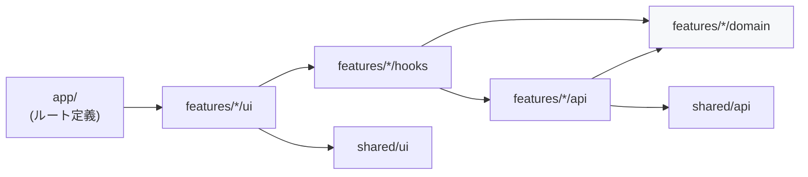

# フロントエンドのディレクトリ構造

対象: `frontend/`。ルーティングは Expo Router（[ADR-0008](../adr/0008-expo-router.md)）、
構成は **feature-based を主軸としたハイブリッド**（[ADR-0009](../adr/0009-feature-based-frontend-structure.md)）。

## 全体像

```
frontend/
├── package.json
├── app.config.ts               # Expo 設定(スキーム・権限・プラグイン)
├── tsconfig.json               # strict: true, paths エイリアス(@/*)
├── .env.example
│
├── app/                        # ルート定義のみ。画面の実装は置かない
│   ├── _layout.tsx             # Provider の合成ルート(Query/Auth/SafeArea/Splash)
│   ├── (auth)/
│   │   ├── _layout.tsx         # 認証済みなら (app) へリダイレクト
│   │   ├── sign-in.tsx
│   │   ├── sign-up.tsx
│   │   └── verify-email.tsx
│   ├── (app)/
│   │   ├── _layout.tsx         # 未認証なら (auth) へリダイレクト + タブ定義
│   │   ├── index.tsx           # ホーム(類義語生成)
│   │   ├── history/
│   │   │   ├── index.tsx
│   │   │   └── [id].tsx
│   │   └── account.tsx
│   └── +not-found.tsx
│
├── src/
│   ├── features/               # 機能単位。追加・削除がここで閉じる
│   │   ├── auth/
│   │   │   ├── domain/         # AuthUser, AuthSession, 認証エラー型
│   │   │   ├── api/            # SupabaseAuthClient(class)
│   │   │   ├── hooks/          # useAuth, useSignIn, useSignUp, useSignOut
│   │   │   └── ui/             # SignInScreen, SignUpScreen, SocialSignInButtons
│   │   └── synonyms/
│   │       ├── domain/         # WordInput(値オブジェクト), Synonym, SynonymSet
│   │       ├── api/            # SynonymApiClient(class), SearchHistoryRepository(class)
│   │       ├── hooks/          # useGenerateSynonyms, useSearchHistory
│   │       └── ui/             # HomeScreen, WordInputField, SynonymList, SynonymCard
│   │
│   ├── shared/                 # 2つ以上の feature から使われるものだけ
│   │   ├── api/
│   │   │   ├── supabaseClient.ts       # 単一インスタンス
│   │   │   ├── SecureSessionStorage.ts # SecureStore アダプタ(分割保存)
│   │   │   └── ApiError.ts             # Edge Function のエラーエンベロープ
│   │   ├── ui/                 # Button, TextField, Banner, Screen, Spinner
│   │   ├── theme/              # 色・余白・タイポグラフィのトークン
│   │   └── lib/                # useNetworkStatus など横断的なユーティリティ
│   │
│   └── types/
│       └── database.types.ts   # supabase gen types の生成物(手で編集しない)
│
└── e2e/                        # Phase 6
```

## 方針: feature-based を主軸にする

### なぜ layer-based にしないか

layer-based（`components/` `hooks/` `services/` を機能横断で並べる）は画面数が少ないうちは
見通しが良いのですが、このプロジェクトの前提と噛み合いません。

- **将来機能の追加が確定している。** 単語帳・例文生成・ロールプレイ会話が控えており
  （[`../roadmap.md`](../roadmap.md)）、layer-based では1機能の追加が
  `components/` `hooks/` `services/` `types/` の全てに散らばります。
- **機能単位で「触る範囲」を閉じたい。** `features/vocabulary/` を1つ足すだけで機能が増え、
  不要になればディレクトリごと消せる状態を保ちます。
- **バックエンドと語彙を揃えられる。** `domain / api / ui` の3層は
  バックエンドの `domain / infrastructure / http`（[`../backend-design.md`](../backend-design.md)）と
  対応しており、両側を行き来する際の認知負荷が下がります。

### なぜ純粋な feature-based にもしないか

共通の `Button` や `supabaseClient` を「どちらかの feature」に置くと、
もう一方が feature をまたいで import することになり、依存が双方向になります。
そのため `shared/` を1つだけ設け、**2つ以上の feature から使われるものだけ**を置きます
（1箇所でしか使わないものは feature 内に留める＝早すぎる共通化を避ける）。

## 依存の向き（守るべき制約）



- **`features/*/domain` は何にも依存しない。** React も Supabase SDK も import しません。
  ここに置くのは型と値オブジェクト（`WordInput` の正規化・検証など）だけです。
- **feature 間の直接 import を禁止します。** `features/synonyms` から
  `features/auth` を参照したくなったら、それは `shared/` に出すべきものです。
  唯一の例外は「認証状態の購読」で、これは `shared` 経由の Context として提供します。
- **`app/` を薄く保ちます。** ファイルベースルーティングに画面実装を書くと、
  画面の再利用（ホームの生成 UI を将来 `(app)/generate` へ移す等）ができず、
  ルーティングライブラリの差し替えが全画面に波及します。
  `app/*.tsx` は原則「`features` の画面コンポーネントを1つ返すだけ」にします。

```tsx
// app/(app)/index.tsx — これ以上のことを書かない
import { HomeScreen } from '@/features/synonyms/ui/HomeScreen';
export default HomeScreen;
```

## パスエイリアス

`tsconfig.json` と Metro の設定で `@/*` → `src/*` を張ります。
`../../../shared/ui/Button` のような相対パスは、ファイル移動のたびに壊れるため使いません。

## バックエンドとの関係

- `frontend/` と `backend/` は**相互に import しません**（[`../repository-structure.md`](../repository-structure.md)）。
- 契約は [`../api-spec.md`](../api-spec.md) が単一の正。
  リクエスト/レスポンスの型は `features/synonyms/api` に**このリポジトリ側で定義**します
  （[ADR-0002](../adr/0002-shared-types-deferred.md)）。
- `src/types/database.types.ts` は `supabase gen types typescript` の生成物です。
  バックエンド側にも同名の生成物がありますが、**共有せずそれぞれ生成**します
  （同じスキーマから生成するため内容は一致します）。
