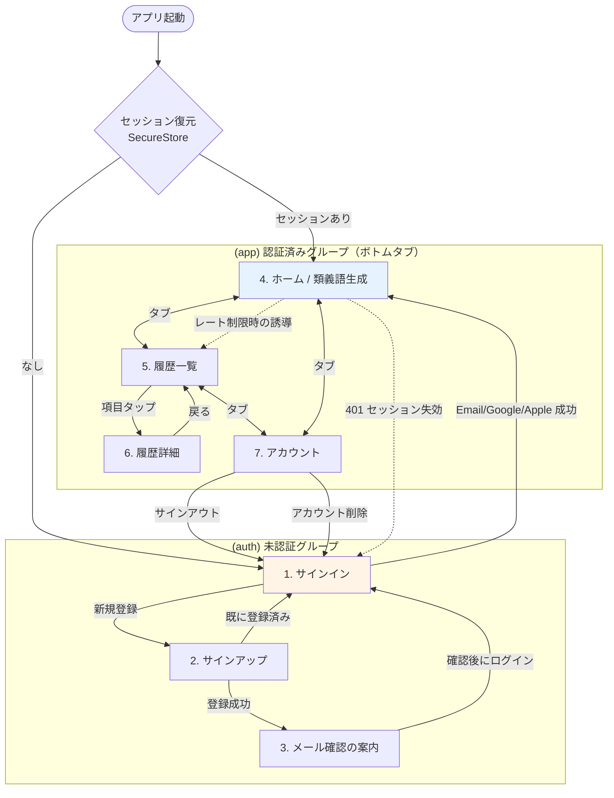

# 画面構成と画面遷移

対象: `frontend/`（React Native + Expo）。MVP のスコープは認証と類義語生成のみ
（[`../roadmap.md`](../roadmap.md)）。エラー時の表示・文言は
[`../error-handling.md`](../error-handling.md) を正とし、ここでは重複させません。

## 画面一覧

| # | 画面 | ルート | 認証 | 役割 |
| --- | --- | --- | --- | --- |
| 1 | サインイン | `(auth)/sign-in` | 不要 | Email+Password / Google / Apple でログイン |
| 2 | サインアップ | `(auth)/sign-up` | 不要 | Email+Password で登録 |
| 3 | メール確認の案内 | `(auth)/verify-email` | 不要 | 確認メール送信済みの案内と再送 |
| 3a | パスワード再設定の依頼 | `(auth)/forgot-password` | 不要 | 再設定メールの送信 |
| 3b | 認証メールの着地点 | `auth-callback` | — | メールのリンクから復帰し、セッションを確立して振り分ける |
| 3c | 新しいパスワードの設定 | `reset-password` | （復帰直後） | 再設定リンクから来たときに新しいパスワードを入力する |
| 4 | ホーム（類義語生成） | `(app)/index` | 必要 | 単語入力 → 生成 → 結果表示 |
| 5 | 履歴一覧 | `(app)/history/index` | 必要 | 過去の検索履歴 |
| 6 | 履歴詳細 | `(app)/history/[id]` | 必要 | 過去の生成結果の再表示 |
| 7 | アカウント | `(app)/account` | 必要 | サインアウト、アカウント削除 |

`(app)` 配下はボトムタブ（**ホーム / 履歴 / アカウント**）で並べます。
履歴詳細はタブ内のスタックにプッシュします。

**`auth-callback` と `reset-password` は `(auth)` にも `(app)` にも属さないルート**に置きます。
認証メールのリンクを処理するとその時点でセッションが確立して「認証済み」になるため、
`(auth)` 配下に置くとガードによって `(app)` へ飛ばされ、
新しいパスワードを入力する画面に留まれなくなるからです。

### ホーム画面と「類義語生成画面」を分けない理由

依頼では「ホーム画面」と「類義語生成画面」が別項目として挙がっていましたが、
**MVP では1つの画面に統合**します。

- MVP の機能は類義語生成1つだけで、ホームに置く他のコンテンツが存在しません。
  分けると「入力するために1タップ増えるだけの空のホーム」になります。
- 生成は入力 → 結果表示が1つの流れであり、画面をまたぐとエラー時の
  「入力値を保持したまま再試行する」（[`../error-handling.md`](../error-handling.md)）が実装しづらくなります。
- 将来ホームに単語帳や学習状況を置く必要が出た時点で、生成部分を
  `(app)/generate` に切り出せます。`features/synonyms/ui` に実装を置くため、
  移動はルート定義の追加だけで済みます（[`directory-structure.md`](./directory-structure.md)）。

## 画面遷移図



- **セッション失効（401）は全画面から起こりえます。** 各画面で個別に扱わず、
  認証状態を持つ `AuthProvider` が失効を検知して `(auth)` にリダイレクトします
  （[`state-management.md`](./state-management.md)）。
- 起動時のセッション復元が終わるまでスプラッシュを表示したままにし、
  **サインイン画面が一瞬見えてからホームに飛ぶ「チラつき」を防ぎます**。

## 各画面の詳細

### 1. サインイン `(auth)/sign-in`

| 要素 | 内容 |
| --- | --- |
| 入力 | メールアドレス、パスワード |
| 主操作 | 「ログイン」ボタン |
| 副操作 | 「Google で続ける」「Apple で続ける」、「新規登録はこちら」 |
| 状態 | `idle` / `submitting` / `error` |

- **Apple のボタンは iOS でのみ表示**します（Android では `expo-apple-authentication` が使えず、
  表示しても押せないボタンになるため）。Apple のブランドガイドラインに沿った公式コンポーネントを使います。
- 送信中は全ボタンを無効化します（二重サインインの防止）。
- 認証エラーは入力欄の下にまとめて表示し、**どちらの項目が誤りかは示しません**
  （メールアドレスの存在有無が漏れるため）。

### 2. サインアップ `(auth)/sign-up`

| 要素 | 内容 |
| --- | --- |
| 入力 | メールアドレス、パスワード（8文字以上） |
| 主操作 | 「登録する」ボタン |
| 遷移 | 成功 → メール確認の案内へ |

- パスワードの要件（8文字以上）は Supabase Auth の設定と一致させます
  （[`../security.md`](../security.md)）。**クライアント側の検証は UX のためであり、
  強制力は Supabase 側にあります。**

### 3. メール確認の案内 `(auth)/verify-email`

メール確認（Confirm email）を有効にしているため、登録直後はまだログインできません。
「確認メールを送りました」の案内と再送ボタンのみを持つ画面です。

- 確認リンクは `openowl://auth-callback` に戻ります
  （`backend/supabase/config.toml` の `additional_redirect_urls` に登録済み）。
- 再送は連打できないよう、押下後60秒間は無効化します（Supabase 側のレート制限に当たる前に止める）。

### 4. ホーム / 類義語生成 `(app)/index`

MVP の中心画面です。

```
┌─────────────────────────────┐
│ OpenOwl                      │
│                              │
│ ┌─────────────────────────┐ │
│ │ 英単語を入力            │ │  ← WordInputField
│ └─────────────────────────┘ │
│ [      類義語を生成      ]   │  ← 送信中は無効 + スピナー
│                              │
│ 本日の残り: 27 / 30          │  ← usage.remainingToday
│                              │
│ ┌─ joyful ── 形容詞 ──────┐ │
│ │ 喜びに満ちた              │ │  ← SynonymCard
│ │ happy より感情が強く…    │ │
│ └─────────────────────────┘ │
│ ┌─ content ── 形容詞 ─────┐ │
│ ...                          │
└─────────────────────────────┘
```

| 状態 | 画面 |
| --- | --- |
| `idle` | 入力欄と生成ボタン。前回の結果は表示したままにする |
| `submitting` | ボタンを無効化しスピナー。3秒経過で「生成中です…」の補足を出す |
| `success` | 結果リストを表示。`source: "cache"` でも見た目は変えない（利用者に区別の意味がない） |
| `error` | エラーバナー + 「もう一度試す」。**入力値は消さない** |

- 残り回数（`usage.remainingToday`）を常時表示します。上限に達してから知るのではなく、
  減っていくことが見える方が納得感があります。
- **同じ単語を過去に検索していた場合**、エラー時に「前回の結果を表示」への導線を出します
  （[`../error-handling.md`](../error-handling.md) のフォールバック方針）。
- 入力の検証（1〜64文字・英字のみ）は**送信前にクライアントで行い**、
  不正な入力でネットワーク往復と課金を発生させません。

### 5. 履歴一覧 `(app)/history/index`

- `search_history` を `created_at` 降順で表示（`outcome <> 'failed'`）。
- 1画面20件、末尾でページング（`range()`）。
- 空状態は「まだ検索していません」＋ホームへの導線。
- **`user_id` での絞り込みはクエリに書きません。RLS が自動的に自分の行だけに限定します**
  （[`../api-spec.md`](../api-spec.md)）。

### 6. 履歴詳細 `(app)/history/[id]`

過去の生成結果をホームと同じ `SynonymList` で表示します。
表示コンポーネントを共有するため、レイアウトの差異が生まれません。

### 7. アカウント `(app)/account`

| 要素 | 内容 |
| --- | --- |
| 表示 | メールアドレス、本日の利用状況 |
| 操作 | サインアウト、**アカウント削除**、プライバシーポリシーへのリンク |

> **アカウント削除は App Store の審査要件です。**
> アプリ内でアカウントを作成できる場合、アプリ内から削除できる導線が必須です
> （[`../security.md`](../security.md#app-store-提出に向けた注意phase-5-で対応)）。
> MVP の機能スコープには挙がっていませんでしたが、審査で確実に指摘されるため画面を用意します。
> 削除は確認ダイアログを挟み、Edge Function `delete-account` を呼ぶ想定です
> （**この Function は未実装。Phase 5 で追加が必要**）。

## オーナーに確認したい設計判断

以下は MVP の機能スコープに明記がなく、こちらで判断せず確認したい項目です。
**いずれも実装しない場合でも Phase 5 は進められます。**

| # | 項目 | 推奨 | 理由 |
| --- | --- | --- | --- |
| 1 | パスワードリセット（「パスワードを忘れた方」） | **入れる** | ないとパスワードを忘れたユーザーが復帰できず、サポート手段もありません。画面1枚（メール入力 → 送信）と `resetPasswordForEmail` の呼び出しで済みます |
| 2 | アカウント削除 | **入れる** | 上記のとおり App Store 審査要件。Edge Function の追加が必要（Phase 5 のバックエンド作業が発生します） |

## 実装時の共通規約（Phase 5 向け）

- 主要な操作要素には `testID` を付けます（Phase 6 の E2E で使用）。
  命名は `<画面>-<要素>-<役割>`（例: `home-word-input`, `home-generate-button`）。
- 画面コンポーネントは `features/*/ui` に置き、`app/` 配下はルート定義のみに保ちます
  （[`directory-structure.md`](./directory-structure.md)）。
- 文言は日本語固定とし、i18n の仕組みは導入しません（MVP の対象は日本語話者のみ）。
