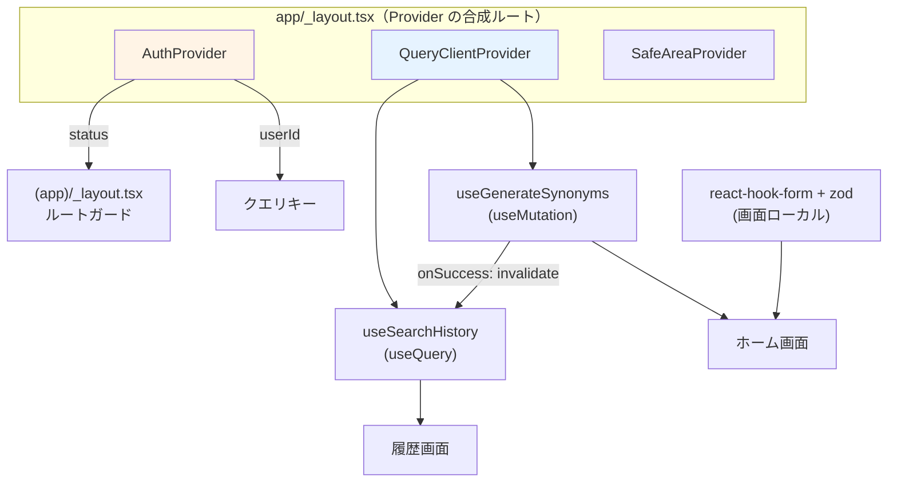

# 状態管理方針

対象: `frontend/`。決定の背景は [ADR-0010](../adr/0010-frontend-state-management.md)。

## 状態を4種類に分けて、それぞれ別の道具で扱う

「全部を1つのストアに入れる」構成は取りません。性質の違う状態を同じ箱に入れると、
サーバ由来のデータの鮮度管理と、画面ローカルの一時状態が混ざって扱いづらくなります。

| 種類 | 例 | 道具 | 置き場所 |
| --- | --- | --- | --- |
| **認証状態** | セッション、ユーザー ID | React Context（`AuthProvider`） | `features/auth/hooks` |
| **サーバ状態** | 類義語の生成結果、検索履歴 | TanStack Query | `features/*/hooks` |
| **フォーム状態** | 入力中の単語、メール・パスワード | react-hook-form + zod | 各画面 |
| **UI 状態** | モーダルの開閉、展開/折りたたみ | `useState` | 各コンポーネント |

**Redux / Zustand などのグローバルストアは導入しません。**
MVP でグローバルに持つ必要がある状態は認証セッション1つだけで、
それは Context で十分だからです。導入を再検討するトリガーは
[ADR-0010](../adr/0010-frontend-state-management.md) に明記しています。

## 1. 認証状態

### AuthProvider

```tsx
// features/auth/hooks/AuthProvider.tsx（概念コード。実装は Phase 5）
interface AuthState {
  readonly status: 'initializing' | 'authenticated' | 'unauthenticated';
  readonly session: Session | null;
  readonly user: AuthUser | null;
}

export function AuthProvider({ children }: PropsWithChildren) {
  // 1. 起動時に SecureStore からセッションを復元する
  // 2. supabase.auth.onAuthStateChange を購読し、以降の変化を state に反映する
  // 3. status が 'initializing' の間はスプラッシュを維持する
}

export function useAuth(): AuthState;
```

- **単一の真実は `supabase-js` のセッションです。** Context はそれを購読して配るだけで、
  独自にトークンを保持したり複製したりしません。二重管理はズレの原因になります。
- `onAuthStateChange` は `SIGNED_IN` / `SIGNED_OUT` / `TOKEN_REFRESHED` /
  `USER_UPDATED` を通知します。**サインアウトとトークン失効の両方がここに来る**ため、
  画面ごとに 401 を扱う必要がありません。
- トークンのリフレッシュは `supabase-js` が自動で行います。自前でタイマーを持ちません。

### ルートガード

Expo Router のルートグループで表現します。各画面に認証チェックを書きません。

```tsx
// app/(app)/_layout.tsx
const { status } = useAuth();
if (status === 'initializing') return null;              // スプラッシュ維持
if (status === 'unauthenticated') return <Redirect href="/sign-in" />;
return <Tabs>...</Tabs>;
```

`(auth)/_layout.tsx` は逆に、認証済みなら `(app)` へ飛ばします。
**この2ファイルだけが認証によるリダイレクトを持ちます。**

### セッションの永続化: SecureStore と 2KB 制限

セッション（アクセストークン + リフレッシュトークン）は
`expo-secure-store` に保存します（iOS Keychain / Android Keystore）。
`AsyncStorage` は平文保存のため使いません（[`../security.md`](../security.md)）。

ただし **SecureStore には1値あたり約 2KB の制限**があり、JWT を含むセッション JSON は
これを超えることがあります。そのため分割保存するストレージアダプタを実装します。

```ts
// shared/api/SecureSessionStorage.ts（概念コード）
export class SecureSessionStorage {
  private static readonly CHUNK_SIZE = 1800;   // 2KB 制限に対する安全側の値

  async getItem(key: string): Promise<string | null>;  // 分割された値を結合して返す
  async setItem(key: string, value: string): Promise<void>;
    // value を CHUNK_SIZE ごとに `${key}.0`, `${key}.1`, … として保存し、
    // 個数を `${key}.__chunks` に記録する。
    // 書き込み前に古いチャンクを消し、断片が残らないようにする。
  async removeItem(key: string): Promise<void>;        // 全チャンクを削除
}
```

これを `createClient` の `auth.storage` に渡します。
**この分割は「実装すれば動く」類の話ではなく、実機で必ず確認してください**
（トークン長はプロバイダとクレーム内容で変わり、Google/Apple ログインの方が長くなります）。

## 2. サーバ状態（TanStack Query）

### クエリキーの設計

```ts
export const queryKeys = {
  searchHistory: (userId: string) => ['search-history', userId] as const,
  searchHistoryItem: (id: string) => ['search-history', 'item', id] as const,
} as const;
```

- **キーに必ず `userId` を含めます。** アカウントを切り替えた際に、
  前のユーザーのキャッシュが表示される事故を防ぐためです。
- サインアウト時は `queryClient.clear()` でキャッシュを全消去します。

### 生成は `useQuery` ではなく `useMutation` にする

これは重要な設計判断です。

```ts
// features/synonyms/hooks/useGenerateSynonyms.ts
useMutation({
  mutationFn: (word: string) => synonymApi.generate(word),
  onSuccess: () => queryClient.invalidateQueries({ queryKey: ['search-history'] }),
});
```

**類義語生成を `useQuery` にしてはいけません。**
`useQuery` は画面復帰・再マウント・ウィンドウフォーカスで自動的に再フェッチします。
このエンドポイントは呼ぶたびに `search_history` へ行を書き、
キャッシュがなければ LLM を呼んで**課金が発生する**ため、
「勝手に再実行される」性質と根本的に相性が悪いのです。
ユーザーの明示的な操作でのみ発火する `useMutation` が正しい選択です。

一方、**検索履歴の取得は `useQuery`** です（副作用がなく、再フェッチしても安全）。

```ts
// features/synonyms/hooks/useSearchHistory.ts
useQuery({
  queryKey: queryKeys.searchHistory(userId),
  queryFn: () => searchHistoryRepository.list({ limit: 20 }),
});
```

### リトライ方針を1箇所に集約する

```ts
// app/_layout.tsx の QueryClient 設定
new QueryClient({
  defaultOptions: {
    queries: { retry: 1, staleTime: 60_000 },
    mutations: {
      retry: (failureCount, error) =>
        error instanceof ApiError &&
        error.retryable &&
        error.code !== 'rate_limited' &&   // 待ち時間が数分〜数時間。自動再送しない
        failureCount < 1,                  // 再送は最大1回
      retryDelay: 800,
    },
  },
});
```

- **`retryable: false` のエラーは絶対に自動リトライしません。**
  `invalid_request` / `not_a_known_word` / `llm_output_truncated` が該当し、
  再送しても同じ結果になるうえ、`llm_output_truncated` は再送するとフル課金が発生します。
- サーバ側も最大1回リトライするため（[`../backend-design.md`](../backend-design.md)）、
  クライアント1回と合わせて **1リクエストあたり最大4回**の Gemini 呼び出しに収まります。
- 生成ボタンは送信中に必ず無効化します（二重送信＝二重課金の防止）。

### エラーの受け取り方

```ts
// shared/api/ApiError.ts（概念コード）
export class ApiError extends Error {
  readonly code: string;             // api-spec.md のエラーコード
  readonly retryable: boolean;
  readonly retryAfterSeconds?: number;
  readonly requestId: string;

  static fromResponse(status: number, body: unknown): ApiError;
  static fromNetworkFailure(error: unknown): ApiError;  // code = 'offline'
}
```

- 画面は `error.code` で分岐せず、**`error.message` をそのまま表示**します。
  表示可能な日本語を返すのはサーバ側の責務です（[`../api-spec.md`](../api-spec.md)）。
  例外は `rate_limited`（`retryAfterSeconds` から待ち時間を出す）と
  `unauthorized`（リダイレクト）だけです。
- `requestId` は問い合わせ用に小さく表示します。

## 3. フォーム状態

`react-hook-form` + `zod` を使います。単語入力の検証ルールは
**バックエンドの `WordText` と同じ**にします。

```ts
export const wordSchema = z
  .string()
  .min(1, '英単語を入力してください')
  .max(64, '64文字以内で入力してください')
  .regex(/^[A-Za-z][A-Za-z'\- ]*$/, '英字で入力してください');
```

送信前にここで弾くことで、**不正な入力でネットワーク往復と課金を発生させません**。

> ⚠️ **この検証ルールはバックエンド（`backend/.../WordText.ts`）と重複します。**
> [ADR-0002](../adr/0002-shared-types-deferred.md) で共通型パッケージを作らないと決めたため、
> 意図的に受け入れている重複です。ただし ADR-0002 は
> 「共有したいドメインロジックが生じた」を再検討トリガーに挙げており、**この正規表現がまさにそれに当たります**。
> 現時点では正規表現1本のため重複を許容しますが、
> Phase 5 の実装時に「片方だけ変更されて食い違う」リスクを再評価してください。
> なお**クライアント側の検証はあくまで UX のためで、強制力はサーバ側にあります**
> （不正な入力は Edge Function が 400 で拒否します）。

## 4. オフラインの扱い

- `@react-native-community/netinfo` で接続状態を監視し、
  TanStack Query の `onlineManager` に接続します（オフライン中の無駄な再試行を止める）。
- オフライン時は生成ボタンを無効化し、上部にバナーを出します。
- **クエリキャッシュの永続化（ディスク保存）は MVP では行いません。**
  そのため、アプリを再起動した直後にオフラインだと履歴は表示できません。
  検索履歴は端末に平文で残る情報であり、保存先の検討（SecureStore は容量的に不向き）と
  暗号化の判断が必要になるのに対し、得られる価値が「起動直後のオフライン閲覧」に限られるためです。
  導入する場合は Phase 6 以降に、保存先とデータの扱いを [`../security.md`](../security.md) に追記したうえで行います。

## 状態と画面の対応（まとめ）


