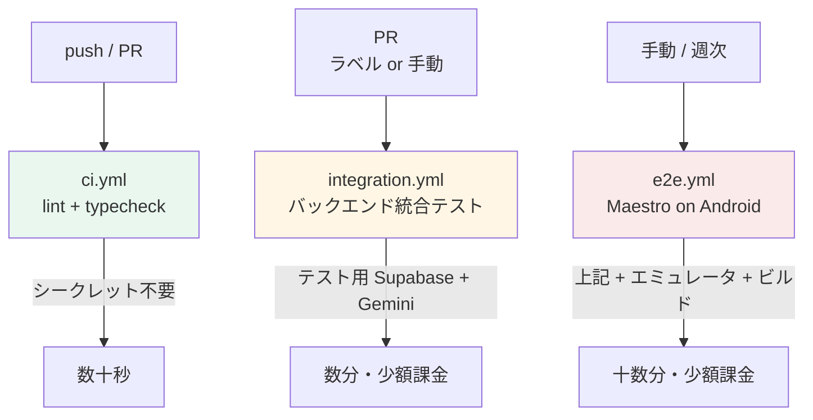

# CI パイプライン設計（GitHub Actions）

## 全体像

ワークフローを**コストと必要な権限で3本に分割**します。1本にまとめると、
シークレットを必要としない軽い検査までシークレット付きで動かすことになり、
フォークからの PR で常に失敗するようになります。

| ワークフロー | 契機 | 所要 | シークレット | 課金 |
| --- | --- | --- | --- | --- |
| [`ci.yml`](../../.github/workflows/ci.yml) | すべての push と PR | 〜1分 | 不要 | なし |
| [`integration.yml`](../../.github/workflows/integration.yml) | PR（`run-integration` ラベル）+ 手動 | 〜3分 | 必要 | LLM 1回程度 |
| [`e2e.yml`](../../.github/workflows/e2e.yml) | 手動 + 週次 | 〜20分 | 必要 | LLM 0〜1回 |

### なぜ E2E を毎プッシュで回さないか

- **実 API に課金が発生する**（[ADR-0006](../adr/0006-no-mocks-testing-policy.md)）。
  プッシュごとに回すと、コミット数に比例して Gemini の消費が増えます。
- **Android エミュレータの起動とアプリのビルドで十数分かかる**。
  フィードバックの速さを最も必要とする lint / typecheck が、その後ろで待たされます。
- 代わりに `ci.yml` を毎回・高速に回し、E2E は**マージ前の確認**として明示的に走らせます。

`ci.yml` が緑でないマージを防ぎたい場合は、リポジトリ設定で
`lint-and-typecheck` を必須チェックに指定してください（オーナー作業）。

## 各ワークフローの構成

### `ci.yml` — 静的検査

| ジョブ | 内容 |
| --- | --- |
| `backend` | `deno lint` / `deno check`（`denoland/setup-deno`） |
| `frontend` | `npm ci` → `npm run lint` → `npm run typecheck` |

- **シークレットを一切参照しません。** フォークからの PR でも動きます。
- `npm ci` はルートで実行します（npm workspaces のため、`frontend` の依存もここで入る）。
- キャッシュは `actions/setup-node` の `cache: npm` に任せます。
  独自のキャッシュキー設計は、ワークスペースが1つの現状では割に合いません。

### `integration.yml` — バックエンド統合テスト

**テスト用 Supabase プロジェクトと実 Gemini API に接続します。**

- 契機を「`run-integration` ラベルの付いた PR」と「手動実行」に絞っています。
  すべての PR で自動実行しないのは、外部からの PR でシークレットが使えず
  必ず失敗するのを避けるためです（GitHub は fork PR にシークレットを渡しません）。
- 同時実行を `concurrency` で1本に制限します。
  テスト用プロジェクトを共有しているため、並行実行するとレート制限や
  データの取り合いで不安定になります。

### `e2e.yml` — Maestro

- `reactivecircus/android-emulator-runner` で Android エミュレータを起動します。
- **iOS は CI に載せません。** macOS ランナーは Linux の10倍の課金係数で、
  MVP の段階では費用に見合いません。iOS は EAS Build + 手元の Simulator で確認します
  （Apple ログインの確認も結局は実機/Simulator が必要）。
- アプリは `expo prebuild` + Gradle でデバッグ APK をビルドします。
  EAS Build を CI から呼ぶ方式は、ビルド待ちのキューとクレジット消費が読みにくいため採りません。

## シークレット管理

**登録はオーナーが行います。AI エージェントには渡さないでください**
（[`../security.md`](../security.md)）。

### GitHub Actions Secrets に登録するもの

| シークレット名 | 用途 | 取得元 |
| --- | --- | --- |
| `TEST_SUPABASE_URL` | テスト用プロジェクトの URL | Supabase ダッシュボード（`OpenOwl-feature`） |
| `TEST_SUPABASE_PUBLISHABLE_KEY` | 一般ユーザーとしての接続（RLS 検証に使う） | 同上 |
| `TEST_SUPABASE_SECRET_KEY` | テストユーザーの作成・削除、テストデータの整理 | 同上。**本番のものを絶対に登録しない** |

### 登録しないもの

- **`GEMINI_API_KEY` は GitHub には登録しません。**
  Edge Function は Supabase 側のシークレットとして持っており、
  CI からは Function を呼ぶだけで、キーそのものを扱う必要がないためです。
  CI に置かない鍵は漏れません。
- **本番プロジェクトの認証情報は一切登録しません。** CI は本番に触れません。

### 取り扱いの規約

- ワークフローのログにシークレットを出力しない（`echo` しない、`set -x` を使わない）。
- `TEST_SUPABASE_SECRET_KEY` を使うジョブは統合テストのみに限定する。
- テスト用プロジェクトにも RLS は本番と同じ設定を適用する
  （テスト用だからと緩めると、RLS の検証自体が無意味になる）。
- シークレットが必要なワークフローには `pull_request_target` を**使わない**。
  フォークのコードをシークレット付きで実行することになり危険です。

## 失敗したときの扱い

| 症状 | 対応 |
| --- | --- |
| `lint` / `typecheck` の失敗 | 実装の問題。修正してから再プッシュ |
| 統合テストで `llm_unavailable` / `llm_timeout` | 外部要因の可能性。**1回だけ**再実行して切り分ける。繰り返すなら Gemini 側の状態を確認 |
| 統合テストで `rate_limited` | テストがユーザーを使い回している可能性。テストの後片付けを確認 |
| RLS のテストが失敗 | **マージしない。** 認可の穴なので、必ず原因を特定する |
| E2E のタイムアウト | エミュレータの起動失敗が多い。ジョブの再実行で切り分ける |

**「flaky だから再実行」で済ませてよいのは、テスト本体が動く前に落ちた場合だけ**です
（エミュレータの起動失敗、依存のインストール失敗など）。
アサーションが落ちた場合は必ず原因を追ってください。

## オーナーの作業

Phase 6 を有効にするために、以下は人間の作業が必要です。

1. GitHub リポジトリの Settings → Secrets に上記3つを登録する
2. （任意）`lint-and-typecheck` を必須チェックに指定する
3. （任意）Actions の使用量上限を確認する。プライベートリポジトリでは実行時間が課金対象
